# Načrt sistema

|                             |                                                         |
| :-------------------------- | :------------------------------------------------------ |
| **Naziv projekta**          | Dog Walkers                           |
| **Člani projektne skupine** | Gašper Božič, Gašper Kolbezen, Grega Kranjec, Matevž Vreš in Gašper Štepec |
| **Kraj in datum**           | Ljubljana, April 2021                                  |

## Povzetek

**TO-DO**

- Povzetek je, kot že vemo, celoten dokument, strnjen v največ 150 besed.

## 1. Načrt arhitekture

### LOGIČNI POGLED
#### Entitete
Za namene boljšega razumevanja smatrajte besedno zvezo **Unikatni identifikator** kot *niz znakov*, ki se uporablja kot primarni ključ vsake entitete.

##### **1. Uporabnik**
Entiteta bo razdeljena na *avtentikacijske*, *osebne* in *ostale* podatke, kjer bodo med **avtentikacijske** spadali vsi podatki, ki so potrebni za primerno avtentikacijo uporabnika, in sicer:
- Uporabniško ime,
- Naključno generirano vrednost,
- Zakriptirano vrednost in
- Vlogo.
> **Unikatni identifikator** enitete bo dodeljen avtomatsko s strani sistema ob registraciji. **geslo** bo v podatkovni bazi seveda primerno zakriptirano s pomočjo naključne vrednosti, ki se bo uporabljala za izračun zakriptirane vrednosti in se bo v kombinaciji z **uporabniškim imenom** uporabljalo za vpis. **Vloga**, predstavljena s celim številom, bo lahko zasedla eno od štirih možnih vrednosti, kjer bodo pomembnost oz. "moč" vloge naraščala sorazmerno z vrednostjo celega števila *(npr. 1 - organizacija, 4 - administrator)*

**osebni** podatki bodo zajemali:
- Polno ime,
- Telefonsko številko, 
- Pošto, ulico in hišno številko in
- Elektronski naslov (elektronski pošta, uporabnika).
> Osebni podatki se bodo ostalim uporabnikom na strani profila prikazali z določenimi omejitvami *(npr. ostalim uporabnikom ne bo razkrita telefonska številka in pa točen naslov uporabnika, ampak zgolj kraj, v katerem prebiva)*

Med **ostale** podatke pa spadajo:
- Javna ocena, 
- Podane ocene in 
- Hitri dostop.
> **Javna ocena uporabnika** se bo samodejno preračunavala glede na ocene podane s strani drugih uporabnikov. **Podane ocene** predstavljajo seznam unikatnih identifikatorjev uporakov, ki jim je uporabnik že podal oceno in služi kot zapisnik, ki uporabniku preprečuje večkratno podajanje ocene istemu uporabniku. **Hitri dostop** pa predstavlja seznam unikatnih identifikatorjev vseh uporabnikov, ki jih je uporabnik "dodal v hitri dostop".

**Struktura**
|                 |                                                        |
| :-------------------------- | :------------------------------------------------------ |
| Unikatni identifikator          | 
*(niz znakov - ustvarjeno samodejno)*
  |
| Uporabniško ime | 
*(niz znakov - obvezno)*
 |
| Naključno generirana vrednost | 
*(niz znakov - obvezno)*
 |
| Zakriptirana vrednost | 
*(niz znakov - obvezno)*
 |
| Vloga | 
*(celo število - min 1, max 4 - privzeto 1)*
 |
| Polno ime | 
*(niz znakov - obvezno)*
 |
| Telefonska številka | 
*(niz znakov - obvezno)*
 |
| Pošta, ulica in hišna številka | 
*(niz znakov - obvezno)*
 |
| Elektronski naslov | 
*(niz znakov - obvezno)*
 |
| Javna ocena | 
*(necelo število - min 0.0, max 5.0 - privzeto nedefinirano)*
 |
| Podane ocene | 
*(seznam **unikatnih identifikatorjev** - privzeto prazen seznam)*
 |
| Hitri dostop | 
*(seznam **unikatnih identifikatorjev** - privzeto prazen seznam)*
 |

##### **2. Oglas**
Entiteta bo vsebovala 4 **vsebinske** lastnosti:
- Opis,
- Lokacija prevzema,
- Slika in
- Cena. 
> izmed naštetih sta slika in cena neobvezna, uporabnika si lahko podrobne informacije izmenjata preko zasebne komunikacije (elektronska pošta)

Poleg omenjenih pa bo vsebovala tudi:
- Oglaševalec
> Vsak oglas bo označen z Oglaševalcem, ki ga je ustvaril.

**Struktura**
|                 |                                                        |
| :-------------------------- | :------------------------------------------------------ |
| Unikatni identifikator          | 
*(niz znakov - ustvarjeno samodejno)*
  |
| Opis          | 
*(niz znakov - obvezno)*
  |
| Lokacija prevzema | 
*(niz znakov - obvezno)*
 |
| Slika | 
*(BLOB - neobvezno)*
 |
| Cena | 
*(število - neobvezno)*
 |
| Oglaševalec | 
*(**unikatni identifikator** - obvezno)*
 |

##### **3. Komentar**
Komentar je entiteta vezana na svojega uporabnika in je zgrajena iz naslednjih lastnosti:
- Uporabnika,
- Vsebina in
- Komentatorja.
> Uporabnik in Komentator v obliki unikatnih identifikatorjev služita kot prejemnik komentarja in podpis komentatorja.

**Struktura**
|                   |                                                        |
| :-------------------------- | :------------------------------------------------------ |
| Unikatni identifikator          | 
*(niz znakov - ustvarjeno samodejno)*
  |
| Vsebina          | 
*(niz znakov - obvezno)*
  |
| Komentator | 
*(**unikatni identifikator** - obvezno)*
 |

#### Relacije med entitetami
Na spodnji sliki so v neformalnem diagramu predstavljene relacije med zamišljenimi entitetami
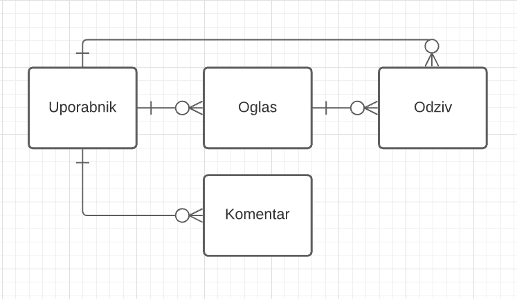

Diagram si interpretiramo na sledeč način.
- en uporabnik lahko ustvari 0 ali več oglasov, kjer en oglas priapda točno enemu uporabniku
- enemu uporabniku lahko pripada 0 ali več komentarjev (ki jih je podal sam, ali pa jih ostali dodali njemu), kjer en komentar pripada točno enemu uporabniku
- en uporabnik lahko ustvari 0 ali več odzivov, kjer en odziv pripada točno enemu uporabniku
- en oglas lahko vsebuje 0 ali več odzivov, kjer je odziv vezan na točno en oglas  

##### **4. Ocena**
Ocenar je entiteta vezana na svojega uporabnika in je zgrajena iz naslednjih lastnosti:
- Uporabnika,
- Ocena in
- Ocenjevalca.
> Uporabnik in Ocenjevalca v obliki unikatnih identifikatorjev služita kot prejemnik ocene in podpis ocenjevalca.

**Struktura**
|                   |                                                        |
| :-------------------------- | :------------------------------------------------------ |
| Unikatni identifikator          | 
*(niz znakov - ustvarjeno samodejno)*
  |
| Ocena          | 
*(število - obvezno)*
  |
| Ocenjevalec | 
*(**unikatni identifikator** - obvezno)*
 |

#### Relacije med entitetami
Na spodnji sliki so v neformalnem diagramu predstavljene relacije med zamišljenimi entitetami
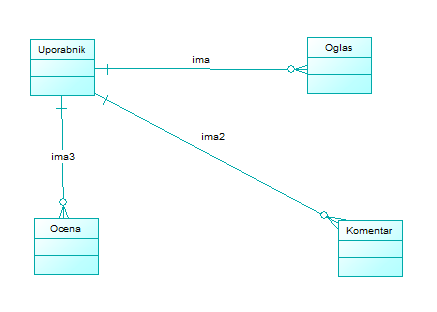

Diagram si interpretiramo na sledeč način.
- en uporabnik lahko ustvari 0 ali več oglasov, kjer en oglas priapda točno enemu uporabniku
- enemu uporabniku lahko pripada 0 ali več komentarjev (ki jih je podal sam, ali pa jih ostali dodali njemu), kjer en komentar pripada točno enemu uporabniku
- en uporabnik lahko ustvari 0 ali več odzivov, kjer en odziv pripada točno enemu uporabniku
- en oglas lahko vsebuje 0 ali več odzivov, kjer je odziv vezan na točno en oglas

### PROCESNI POGLED
Čelni del aplikacije izdelan po konceptu **Single Page Application (SPA)**. Za izvajanje bo poskrbel spletni brskalnik odjemalca. Zaledni del bo v obliki **Restful API**-ja dostopen na spletnem strežniku, kjer bo komuniciral z glavno podatkovno bazo. Razdelili ga bomo na dve mikrostoritvi, ki bosta monitorirali dostop do podatkov v glavni podatkovni bazi.

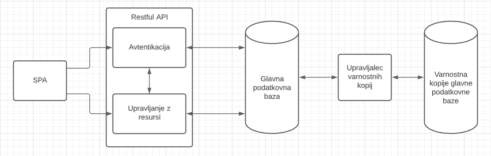

Poleg omenjenega bo za periodično varnostno kopiranje podatkov glavne podatkovne baze skrbel **Upravljalec varnostnih kopij**, ki bo imel dostop do glavne in varnostne kopije podatkovne baze

### RAZVOJNI POGLED
Arhitektura **spletne aplikacije** bo zasnovana po vzorcu **model-pogled-krmilnik** oz. **MVC** 

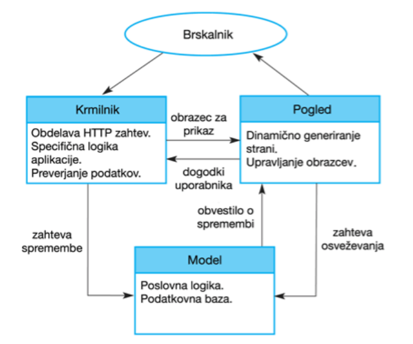

Vsaka entiteta bo ustrezno preslikana v sebi pripadajoč *model*. Vsakemu modelu bo pripadal samostojen *Krmilnik*, ki bo implementiral potrebne **CRUD** operacije za model, ki mu pripadajo. 

*Pogled* modela bo na čelnem delu dinamično prikazoval potrebne obrazce za ustvarjanje novega zapisa modela v podatkovni bazi, posodabljanje že obstoječega zapisa, omogočal pa bo tudi prikaz *master-detail* vzorca in opcijo izbrisa zapisa modela iz podatkovne baze.

#### **Avtentikacija**
Dostop do podatkov bo regulirala komponenta za avtentikacijo, kjer bo sistem avtentkacije implementiran po principu **JWT**. 

Vsaka HTTP zahteva po podatkih bo pred dostopom do podatkovne baze pregledana s strani *avtentikacijske komponente*, ki bo v tem scenariju delovala kot semafor za *komponento za uporavljanje s podatki*. 
- **V primeru avtorizacije** s strani avtentikacijske komponente bo komponenta za upravaljanje s podatki izvedla transakcijo s podatkovno bazo. 
- **V primeru zavrnitve avtorizaicije** bo na zahtevo HTTP odgovorila z ustrezno zavrnitveno kodo in sporočilom o napaki.

#### **Izvorna koda aplikacije**
Izvorna koda aplikacije se bo nahajala na oddaljenem GitHub repozitoriju, kjer bo nit razvoja razvejana na *produkcijsko* in *razvojno* vejo, *razvojna* veja pa bo po potrebi razvejana na dodatne veje za boljši pregled in nadzor.

### FIZIČNI POGLED
RESTAPI in Upravljalec varnostnih kopij bosta nameščena in se izvajala na istem spletnem strežniku, s katerim bo komuniciral spletni brskalnik odjemalca, ki bo skrbel za izvajanje in procesiranje čelnega dela aplikacije.

Za gostovanje podatkovnih baz bomo uporabili **MongoDB Atlas strežnike**, kjer bo podatkovna baza z varnostno kopijo gostovana na različni lokaciji kot glavna podatkovna baza

## 2. Načrt strukture

### 2.1 Razredni diagram

**TO-DO**

- Izdelajte razredni diagram.

### 2.2 Opis razredov

**TO-DO**

- Vsak razred podrobno opišite. Opis posameznega razreda naj ima sledečo strukturo:

#### Ime razreda **TO-DO**

- Koncept iz problemske domene, ki ga razred predstavlja.

#### Atributi

**TO-DO**

- Za vsak atribut navedite:
  - ime atributa,
  - podatkovni tip, če ta ni očiten,
  - pomen, če ta ni samoumeven,
  - zalogo vrednosti, če ta ni neomejena ali očitna.

#### Nesamoumevne metode

**TO-DO**

- Za vsako metodo navedite:
  - ime metode,
  - imena in tipe parametrov,
  - tip rezultata,
  - pomen (če ta ni dovolj očiten iz naziva metode in njenih parametrov).

## 3. Načrt obnašanja

  ### 3.1. Registracija uporabnika  

  **OSNOVNI TOK**  
  Diagram poleg osnovnega toka predstavlja tudi izjemni tok, kjer je e-naslov že uporabljen.  
  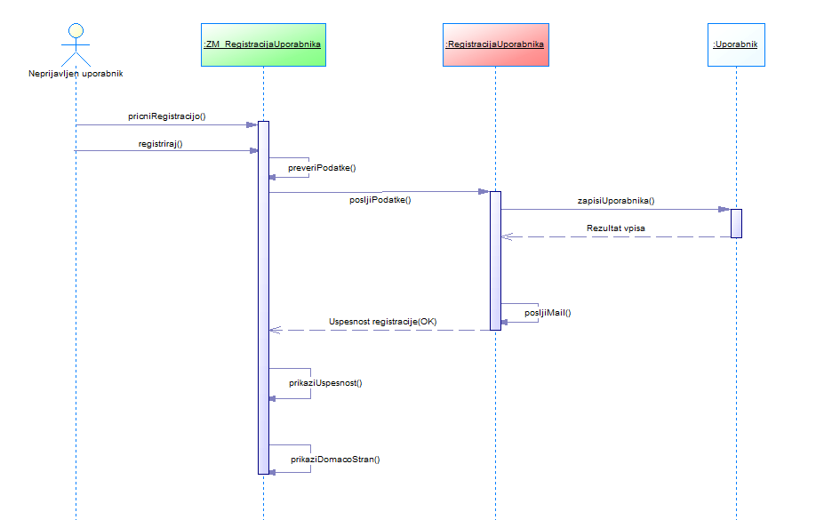  
    
  **IZJEMNI TOK**  
  Diagram predstavlja izjemne tokove neustreznih podatkov.  
  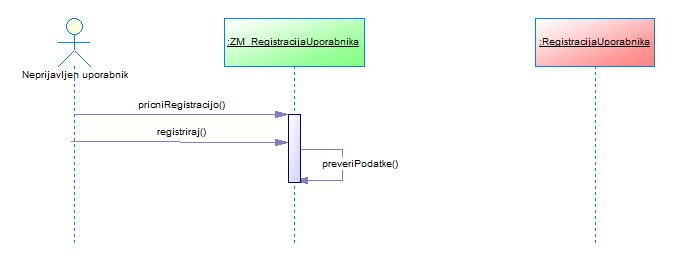  

  ### 3.2 Prijava uporabnika

  

  ### 3.3. Urejanje uporabniškega profila  

  **OSNOVNI TOK**  
  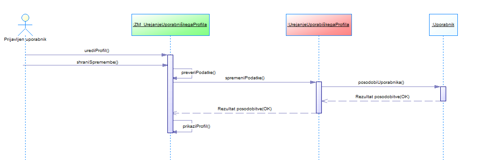  
    
  **IZJEMNI TOKOVI**  
  Diagram prikazuje izjemne tokove, kjer so bili vnešeni nedovoljeni znaki, neustrezen format podatkov (npr. e-naslova) ali pa je bilo prekoračeno dovoljeno število znakov.  
  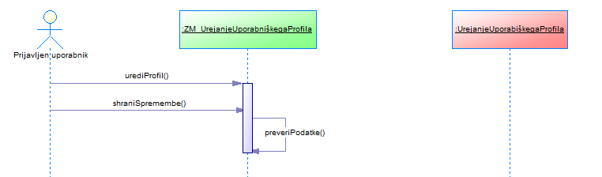  
    
  Diagram prikazuje izjemni tok, kjer uporabnik navigira proč od strani brez shranjevanja sprememb.  
  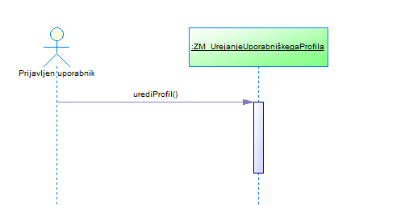  

  ### 3.4. Pregled vseh oglasov  
  Funkcionalnost je bila združena s funkcionalnostjo "Iskanje oglasov".

  ### 3.5. Ogled posameznega oglasa  

  **OSNOVNI TOK**  
  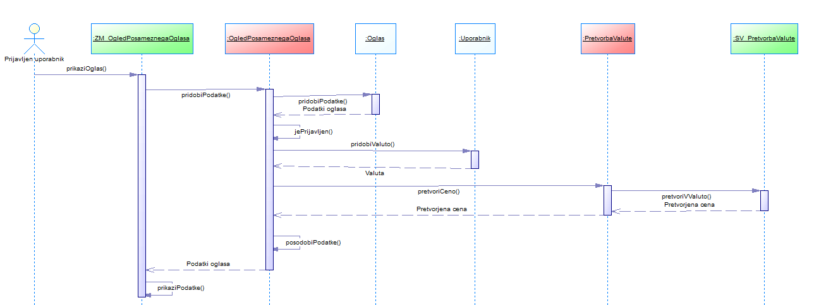  
    
  **ALTERNATIVNI TOKOVI**  
  Diagram prikazuje alternativni tok, kjer si oglas ogleduje neprijavljen uporabnik z manj funkcionalnostmi.  
  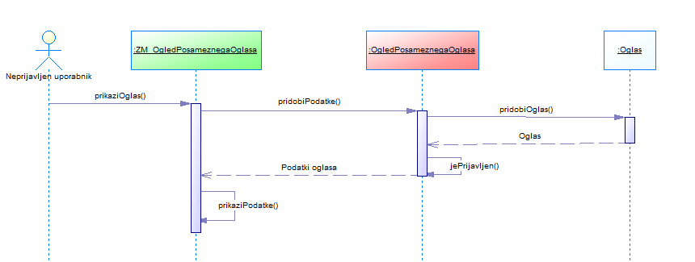  

  Diagram prikazuje alternativni tok, kjer si uporabnik ogleda lokacijo prevzema na sameme oglasu.
  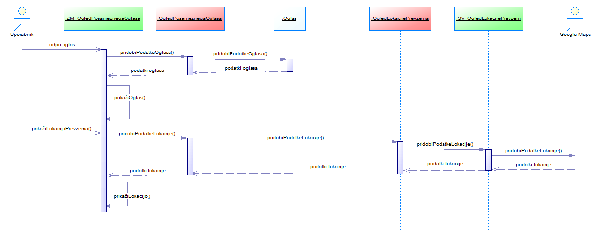  
  
  **IZJEMNI TOK**  
  Diagram prikazuje izjemni tok, kjer odpove zunanji sistem.  
  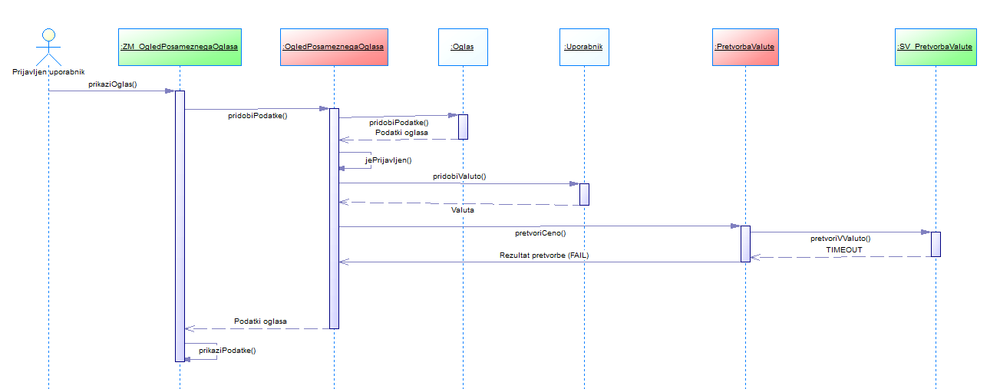  

  ### 3.6. Ogled oglasa in lokacije prevzema  
  Funkcionalnost je bila združena s funkcionalnostjo "Ogled posameznega oglasa".

  ### 3.7. Ogled profila  

  **OSNOVNI TOK**  
  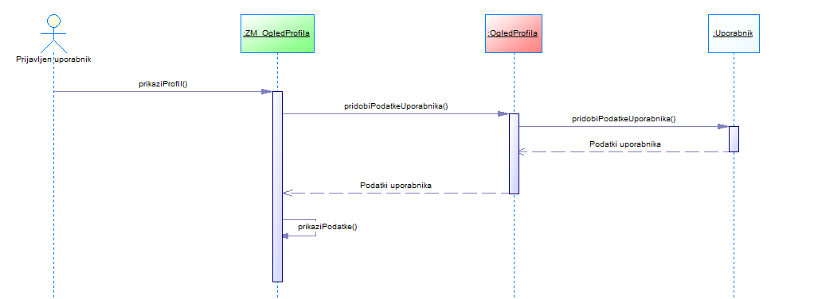  

  ### 3.8. Kreacija oglasa  

  **OSNOVNI TOK**  
  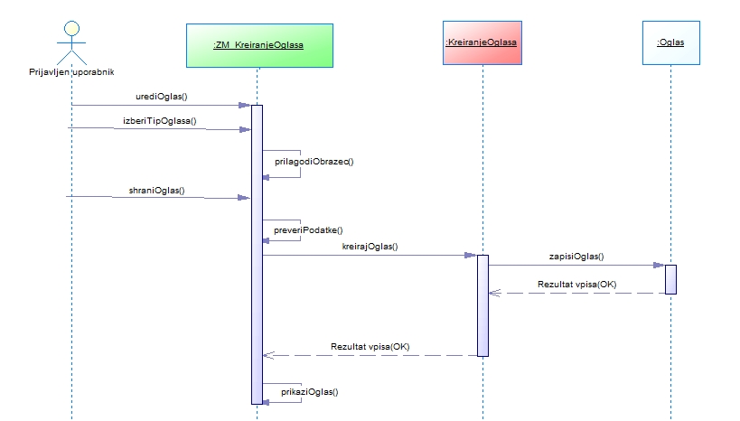  
    
  **IZJEMNI TOK**  
  Diagram prikazuje izjemni tok, kjer so bili vnešeni neustrezni podatki ali pa podatki manjkajo.  
  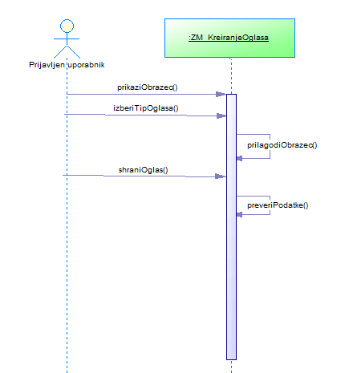  
  
  ### 3.9. Vzdrževanje oglasa  

  **OSNOVNI TOK**  
  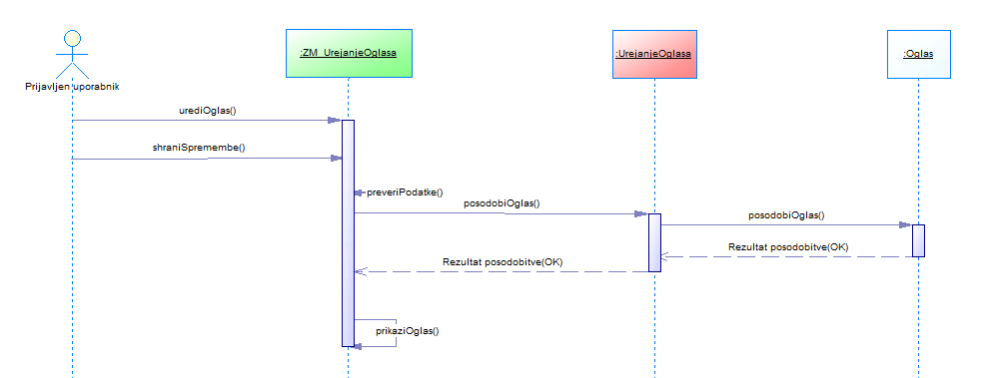  
    
  **IZJEMNI TOK**  
  Diagram prikazuje izjemni tok, kjer so bili vnešeni neustrezni podatki ali pa podatki manjkajo.  
  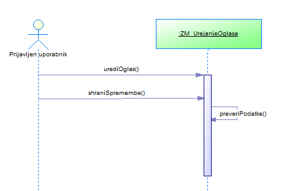  
  
  ### 3.10. Brisanje oglasa  
    
  **OSNOVNI TOK**  
  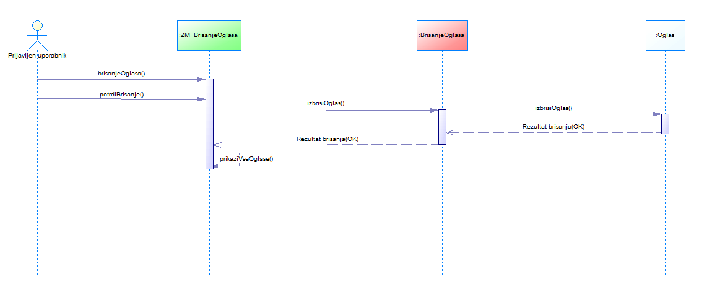  
    
  **ALTERNATIVNI TOK**  
  Diagram prikazuje alternativni tok, kjer uporabnik ne potrdi brisanja oglasa.  
  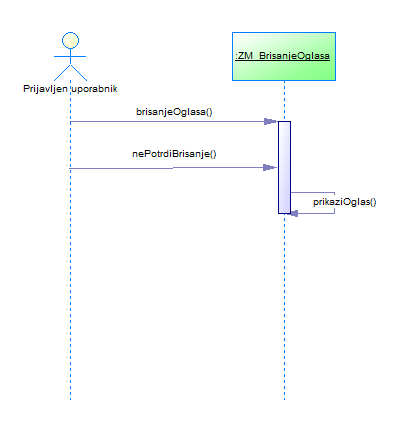  
     
  **IZJEMNI TOK**  
  Diagram prikazuje izjemni tok, kjer uporabnik navigira proč od strani brez potrditve brisanja.  
  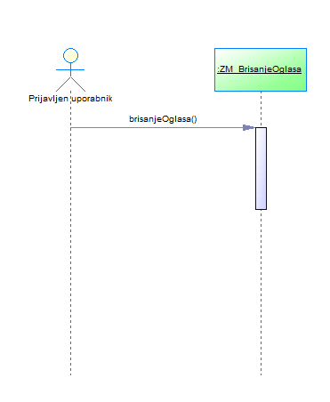   

  ### 3.11. Dodaj Hitri Kontakt

  **OSNOVNI TOK**
  

  **ALTERNATIVNI TOK ADMIN**
  Diagram prikazuje alternativni tok, kjer je akter tipa Admin
  

  **IZJEMNI TOK PREMIUM**
  

  **IZJEMNI TOK ADMIN**
  Diagram prikazuje alternativni izjemni tok, kjer je akter tipa Admin
  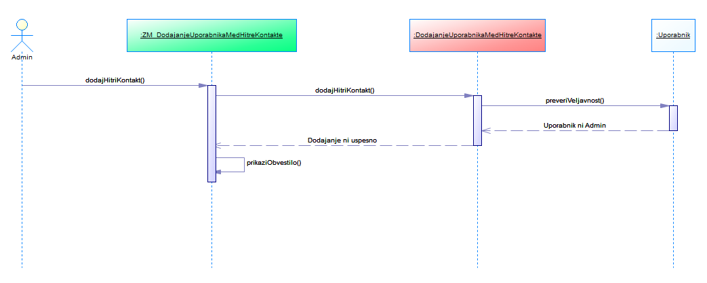

     
  ### 3.12. Ogled hitrih kontaktov
    
  **OSNOVNI TOK** 
  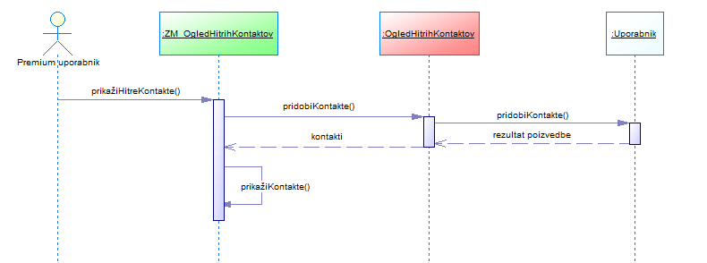

  **ALTERNATIVNI TOK**   
  Diagram prikazuje alternativni tok, kjer je akter tipa Admin
  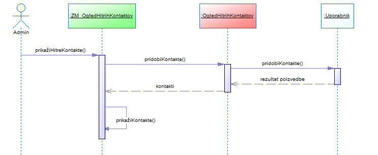

  ### 3.13. Odstranitev uporabnika iz hitrih kontaktov
    
  **OSNOVNI TOK**  
  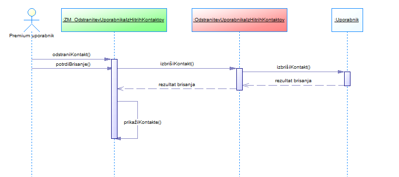

  **ALTERNATIVNI TOK**   
  Diagram prikazuje alternativni tok, kjer je akter tipa Admin
  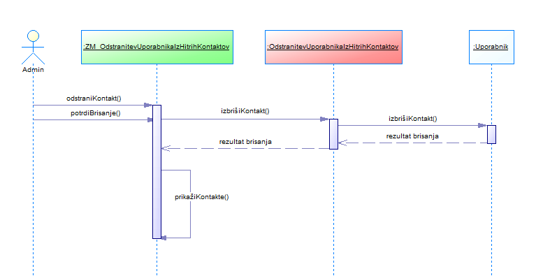
    
  ### 3.14. Odziv na oglas  
    
  **OSNOVNI TOK**  
  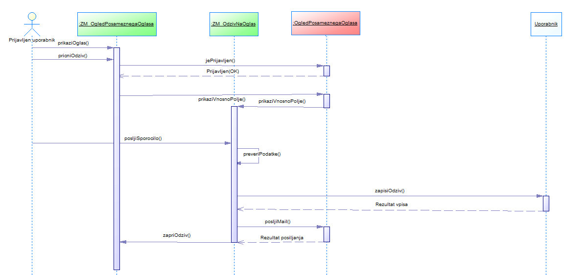  

  **IZJEMNI TOKOVI**  
  Diagram prikazuje izjemni tok, kjer uporabnik vnese neustrezne podatke.  
  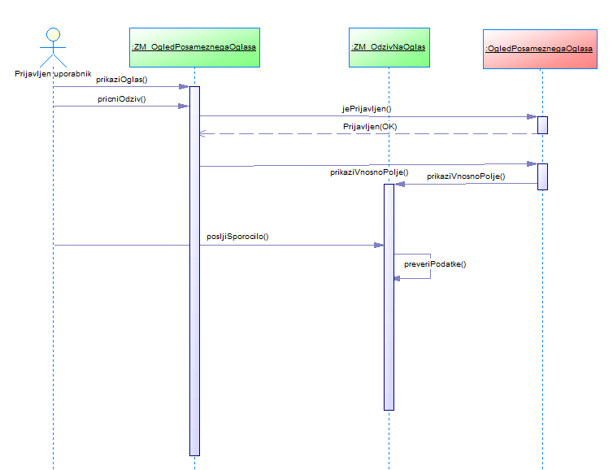  
    
  Diagram prikazuje izjemni tok, kjer se na oglas poskusi odzvati neprijavljen uporabnik.  
  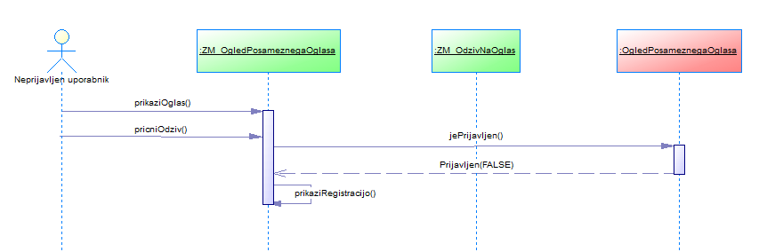  

      
  ### 3.16. Podaj oceno profilu  
    
  **OSNOVNI TOK**  
  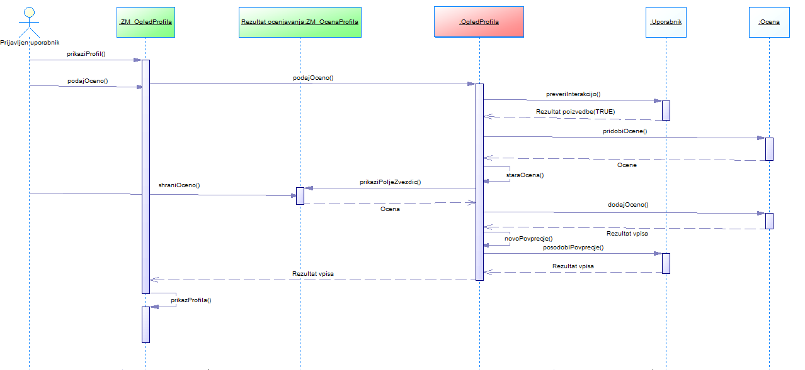  
    
  **IZJEMNI TOKOVI**  
  Diagram prikazuje izjemni tok, kjer uporabnik ne potrdi podajanja ocene.  
  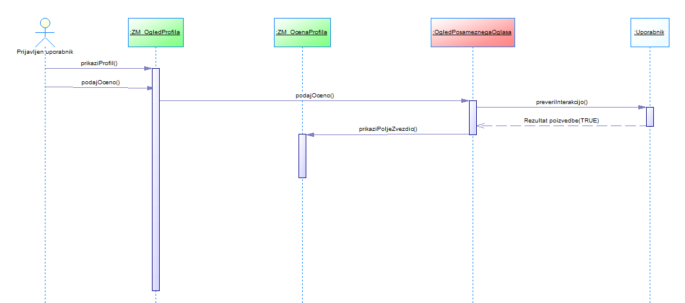  
    
  Diagram prikazuje izjemni tok, kjer uporabnika v bazi nimata zapisane nobene interakcije.  
  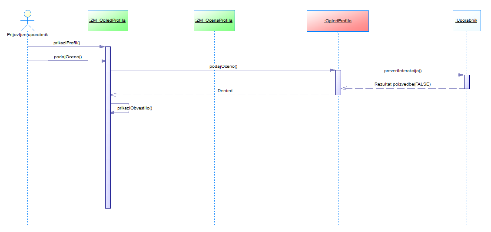  
    
    
  ### 3.17. Iskanje oglasov  
    
  **OSNOVNI TOK**  
  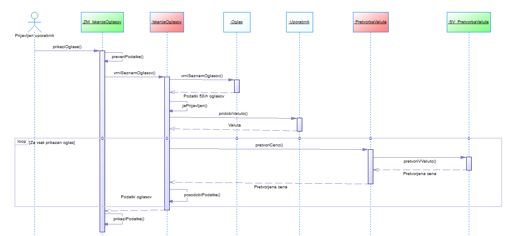  
    
  **ALTERNATIVNI TOK**  
  Diagram prikazuje alternativni tok, kjer si oglase ogleduje neprijavljen uporabnik.  
  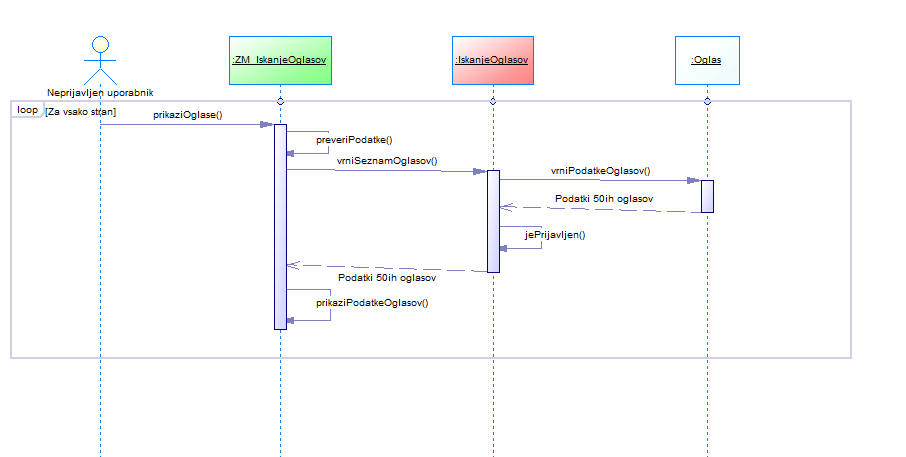  
    
  **IZJEMNI TOKOVI**  
  Diagram prikazuje izjemni tok, kjer odpove zunanji sistem.  
  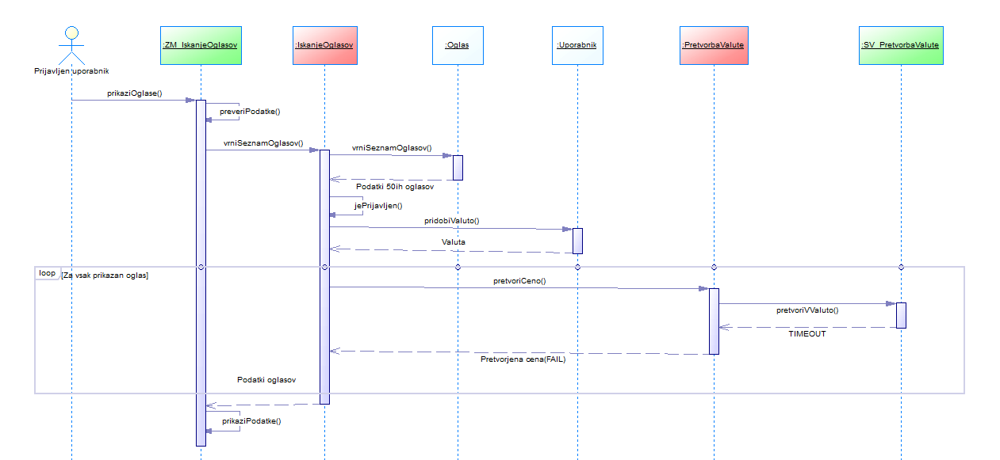  
    
  Diagram prikazuje izjemni tok, kjer uporabnik vnese nedovoljene znake v iskalni niz.  
  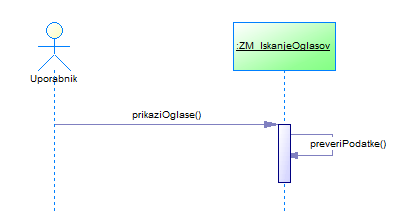  
    

  ### 3.18. Podaj komentar profilu
    
  **OSNOVNI TOK**   
  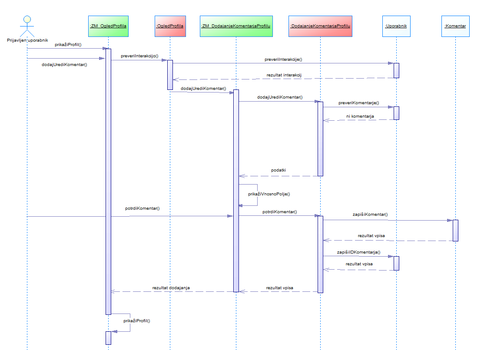

  **ALTERNATIVNI TOK**  
  Diagram prikazuje alternativni tok, kjer uporabnik ureja svoj že obstoječi komentar.
  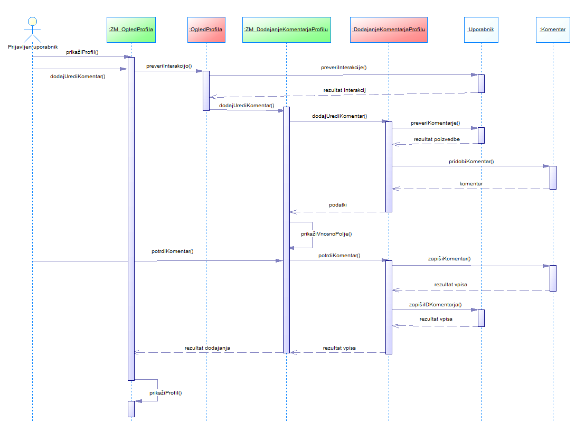

  **IZJEMNI TOKOVI**  
  Diagram prikazuje izjemni tok, kjer uporabnik med podajanjem komentarja navigira
  stran od zaslonske maske.
  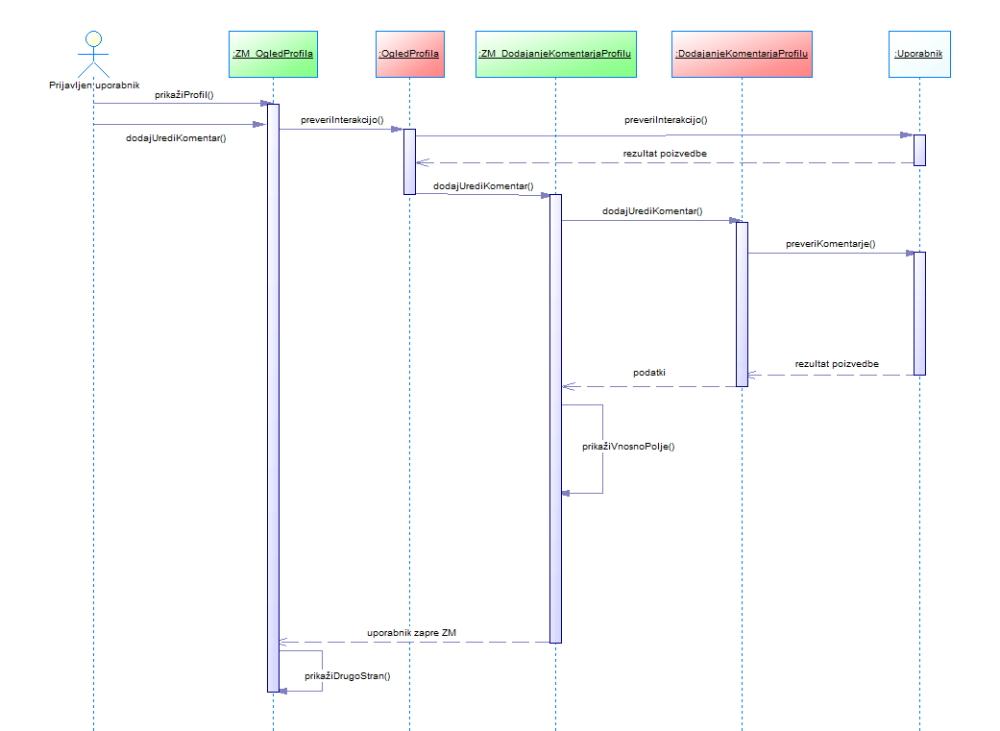

  Diagram prikazuje izjemni tok, kjer uporabnik poizkusi podati komentar, vendar še nima interakcij s tem uporabnikom, ki bi mu dovoljevale dodajanje komentarja.
  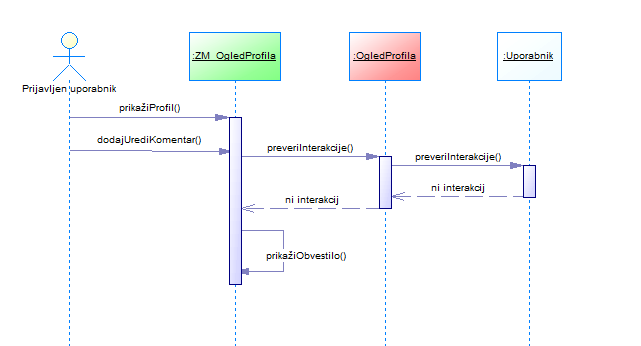

  ### 3.19. Brisanje komentarjev
    
  **OSNOVNI TOK** 
  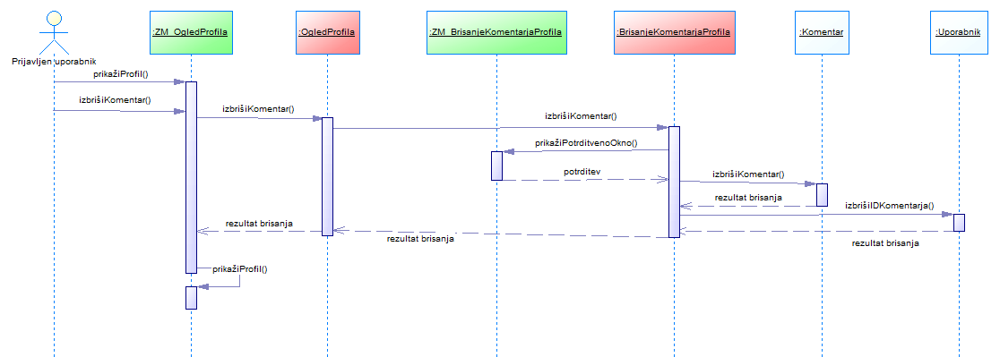

  **IZJEMNI TOKOVI**   
  Diagram prikazuje izjemni tok, kjer uporabnik zapre pojavitveno okno, ki se pojavi ob kliku na brisanje komentarja.
  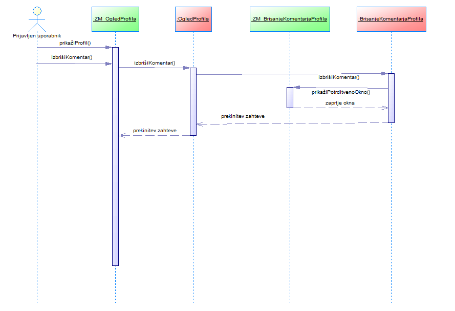

  Diagram prikazuje izjemni tok, kjer uporabnik zavrne potrditev v oknu, ki se pojavi ob kliku na brisanje komentarja.
  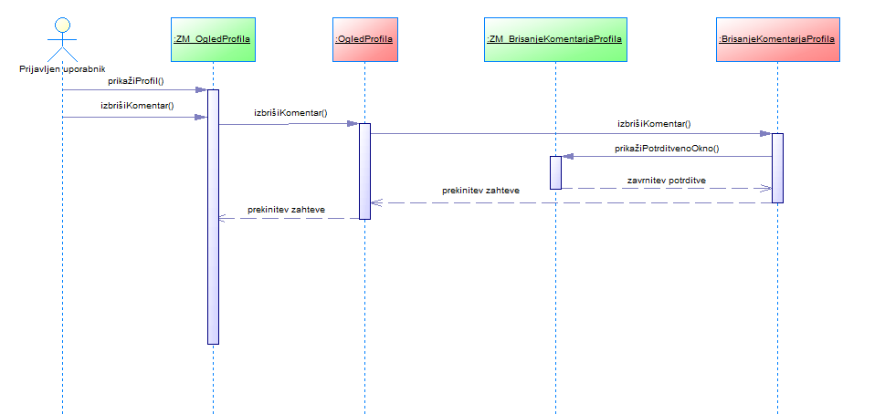
    
  
