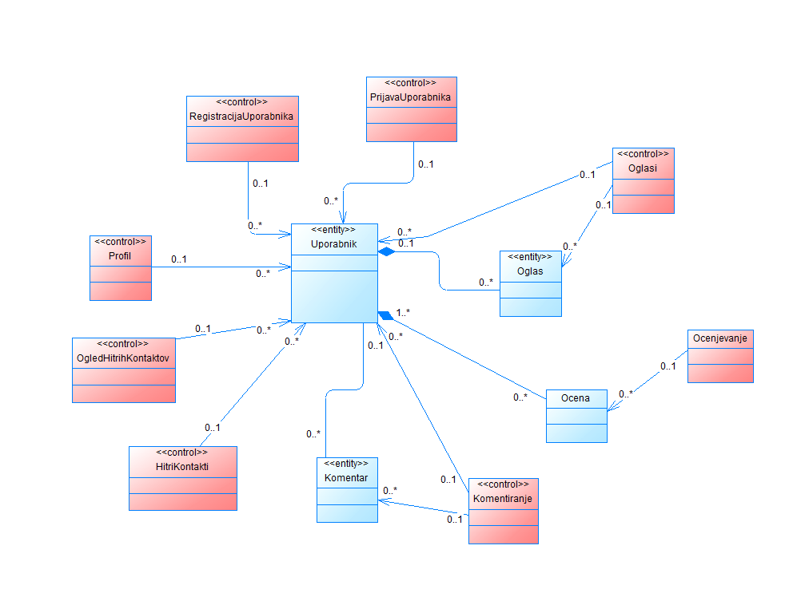
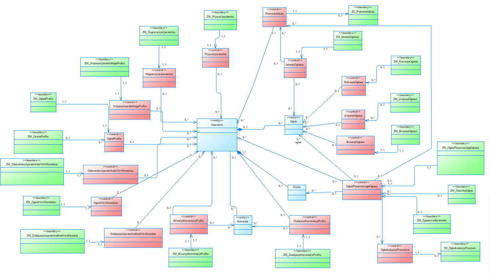
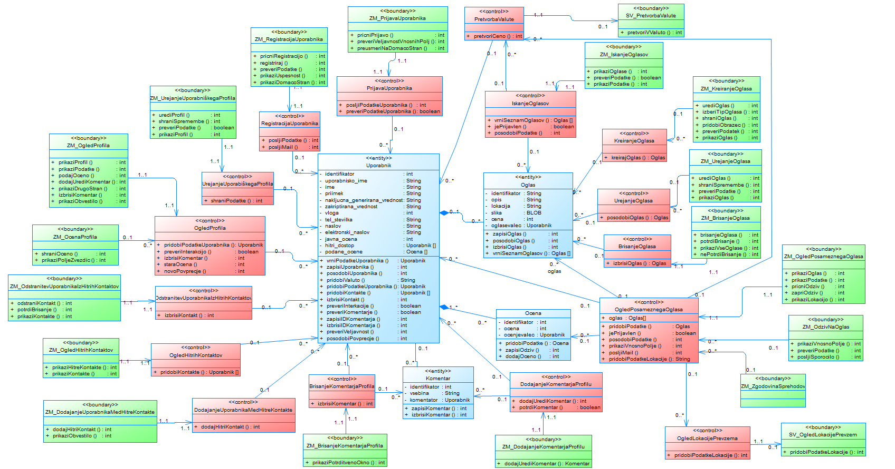
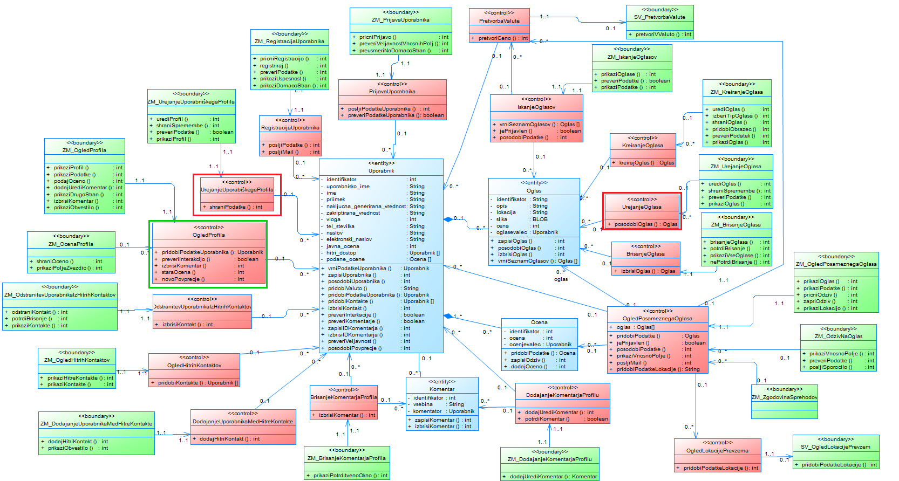
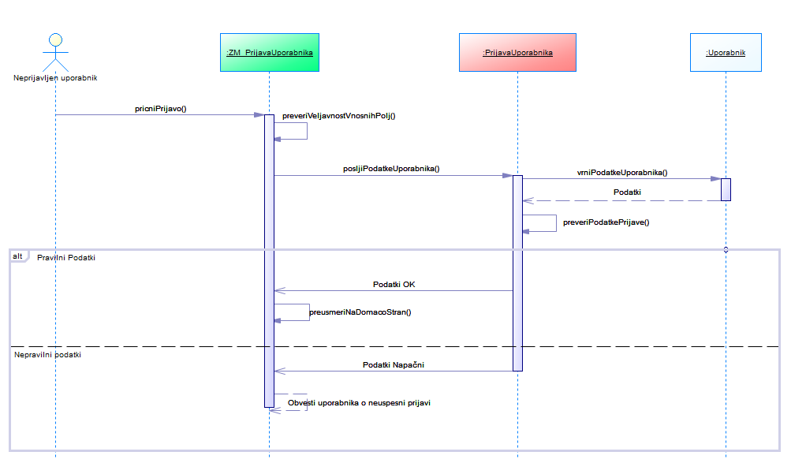
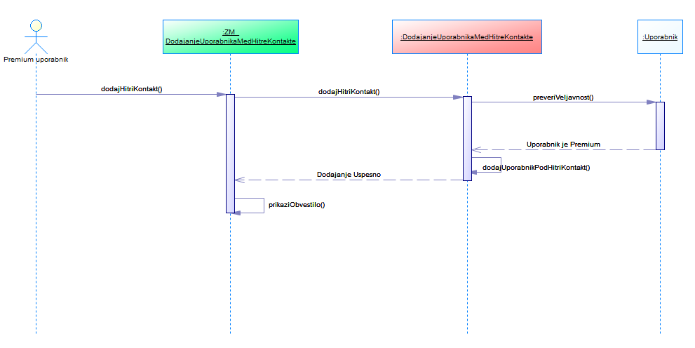
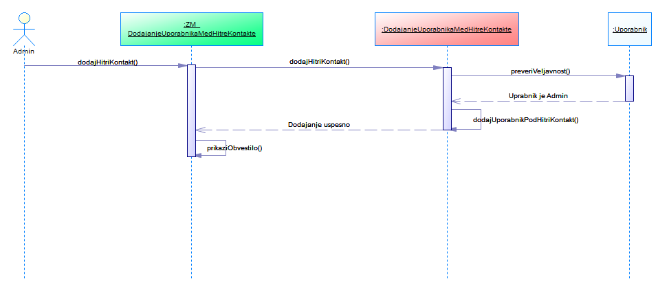
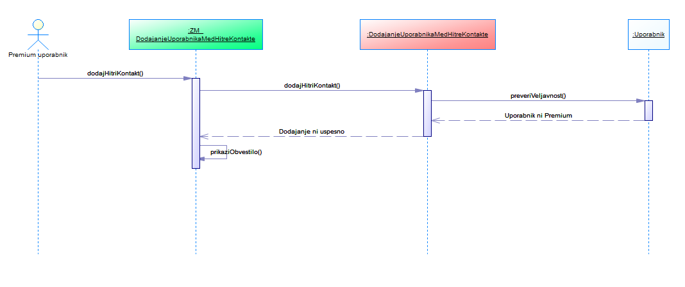
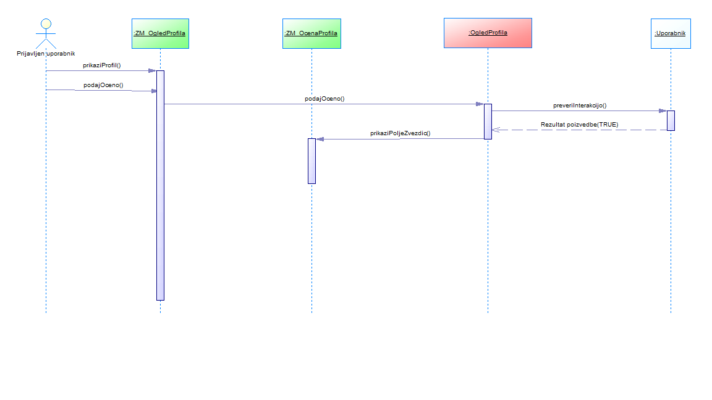

# Načrt sistema

|                             |                                                         |
| :-------------------------- | :------------------------------------------------------ |
| **Naziv projekta**          | Dog Walkers                           |
| **Člani projektne skupine** | Gašper Božič, Gašper Kolbezen, Grega Kranjec, Matevž Vreš in Gašper Štepec |
| **Kraj in datum**           | Ljubljana, April 2021                                  |

## Povzetek

V tej fazi projekta smo razvili načrt arhitekture, ki zajema logični, procesni, razvojni in fizični pogled. 
V logičnem pogledu so predstavljene same abstrakcije entitet, njihove strukture in uporabljeni podatki v njih ter relacije med njimi. Prikazane so tudi na shemi kontrolnih razredov in entitet. 
V procesnem pogledu je zajeta arhitekturna shema sistema, predstavljena sta čelni in zaledni del sistema in njune komponente. 
Znotraj razvojnega pogleda je predstavljena uporabljena arhitekturna zasnova po vzorcu MVC, 
opisana je tudi je avtentikacija, ki bo implementirana po principu JWT. Prikazan je tudi oris sheme
celotnega razrednega diagrama.
Fizični pogled zajema upravljanje z varnostnimi kopijami in način uporabe podatkovnih baz 
preko gostiteljskega strežnika MongoDB Atlas. 
V razdelku načrt strukture se nahaja razredni diagram sistema s pripadajočimi atributi, metodami in njihovimi opisi. 
Opisali smo tudi načrtovalske vzorce strategije, singletona in adapterja, 
ki smo jih uporabili pri dizajniranju razrednega diagrama. 
Na koncu sledi še poglavitni razdelek z načrtom obnašanja, v katerem je skupek diagramov zaporedja, 
uporabljenih pri predstavitvi funkcionalnosti in njihovih osnovnih, alternativnih in izjemnih tokov. 

## 1. Načrt arhitekture

### LOGIČNI POGLED

**DIAGRAM**  
  

#### Entitete
Za namene boljšega razumevanja smatrajte besedno zvezo **Unikatni identifikator** kot *niz znakov*, ki se uporablja kot primarni ključ vsake entitete.

##### **1. Uporabnik**
Entiteta bo razdeljena na *avtentikacijske*, *osebne* in *ostale* podatke, kjer bodo med **avtentikacijske** spadali vsi podatki, ki so potrebni za primerno avtentikacijo uporabnika, in sicer:
- Uporabniško ime,
- Naključno generirano vrednost,
- Zakriptirano vrednost in
- Vlogo.
> **Unikatni identifikator** enitete bo dodeljen avtomatsko s strani sistema ob registraciji. **geslo** bo v podatkovni bazi seveda primerno zakriptirano s pomočjo naključne vrednosti, ki se bo uporabljala za izračun zakriptirane vrednosti in se bo v kombinaciji z **uporabniškim imenom** uporabljalo za vpis. **Vloga**, predstavljena s celim številom, bo lahko zasedla eno od štirih možnih vrednosti, kjer bodo pomembnost oz. "moč" vloge naraščala sorazmerno z vrednostjo celega števila *(npr. 1 - organizacija, 4 - administrator)*

**osebni** podatki bodo zajemali:
- Polno ime,
- Telefonsko številko, 
- Pošto, ulico in hišno številko in
- Elektronski naslov (elektronski pošta, uporabnika).
> Osebni podatki se bodo ostalim uporabnikom na strani profila prikazali z določenimi omejitvami *(npr. ostalim uporabnikom ne bo razkrita telefonska številka in pa točen naslov uporabnika, ampak zgolj kraj, v katerem prebiva)*

Med **ostale** podatke pa spadajo:
- Javna ocena, 
- Podane ocene in 
- Hitri dostop.
> **Javna ocena uporabnika** se bo samodejno preračunavala glede na ocene podane s strani drugih uporabnikov. **Podane ocene** predstavljajo seznam unikatnih identifikatorjev uporakov, ki jim je uporabnik že podal oceno in služi kot zapisnik, ki uporabniku preprečuje večkratno podajanje ocene istemu uporabniku. **Hitri dostop** pa predstavlja seznam unikatnih identifikatorjev vseh uporabnikov, ki jih je uporabnik "dodal v hitri dostop".

**Struktura**
|                 |                                                        |
| :-------------------------- | :------------------------------------------------------ |
| Unikatni identifikator          | 
*(niz znakov - ustvarjeno samodejno)*
  |
| Uporabniško ime | 
*(niz znakov - obvezno)*
 |
| Naključno generirana vrednost | 
*(niz znakov - obvezno)*
 |
| Zakriptirana vrednost | 
*(niz znakov - obvezno)*
 |
| Vloga | 
*(celo število - min 1, max 4 - privzeto 1)*
 |
| Polno ime | 
*(niz znakov - obvezno)*
 |
| Telefonska številka | 
*(niz znakov - obvezno)*
 |
| Pošta, ulica in hišna številka | 
*(niz znakov - obvezno)*
 |
| Elektronski naslov | 
*(niz znakov - obvezno)*
 |
| Javna ocena | 
*(necelo število - min 0.0, max 5.0 - privzeto nedefinirano)*
 |
| Podane ocene | 
*(seznam **unikatnih identifikatorjev** - privzeto prazen seznam)*
 |
| Hitri dostop | 
*(seznam **unikatnih identifikatorjev** - privzeto prazen seznam)*
 |

##### **2. Oglas**
Entiteta bo vsebovala 4 **vsebinske** lastnosti:
- Naziv,
- Opis,
- Lokacija prevzema,
- Slika in
- Cena. 
> izmed naštetih sta slika in cena neobvezna, uporabnika si lahko podrobne informacije izmenjata preko zasebne komunikacije (elektronska pošta)

Poleg omenjenih pa bo vsebovala tudi:
- Oglaševalec
> Vsak oglas bo označen z Oglaševalcem, ki ga je ustvaril.

**Struktura**
|                 |                                                        |
| :-------------------------- | :------------------------------------------------------ |
| Unikatni identifikator          | 
*(niz znakov - ustvarjeno samodejno)*
  |
| Naziv          | 
*(niz znakov - obvezno)*
  |
| Opis          | 
*(niz znakov - obvezno)*
  |
| Lokacija prevzema | 
*(niz znakov - obvezno)*
 |
| Slika | 
*(BLOB - neobvezno)*
 |
| Cena | 
*(število - neobvezno)*
 |
| Oglaševalec | 
*(**unikatni identifikator** - obvezno)*
 |

##### **3. Komentar**
Komentar je entiteta vezana na svojega uporabnika in je zgrajena iz naslednjih lastnosti:
- Uporabnika,
- Vsebina in
- Komentatorja.
> Uporabnik in Komentator v obliki unikatnih identifikatorjev služita kot prejemnik komentarja in podpis komentatorja.

##### **4. Ocena**
Ocenar je entiteta vezana na svojega uporabnika in je zgrajena iz naslednjih lastnosti:
- Uporabnika,
- Ocena in
- Ocenjevalca.
> Uporabnik in Ocenjevalca v obliki unikatnih identifikatorjev služita kot prejemnik ocene in podpis ocenjevalca.

**Struktura**
|                   |                                                        |
| :-------------------------- | :------------------------------------------------------ |
| Unikatni identifikator          | 
*(niz znakov - ustvarjeno samodejno)*
  |
| Ocena          | 
*(število - obvezno)*
  |
| Ocenjevalec | 
*(**unikatni identifikator** - obvezno)*
 |

#### Relacije med entitetami
Na spodnji sliki so v neformalnem diagramu predstavljene relacije med zamišljenimi entitetami

Diagram si interpretiramo na sledeč način.
- en uporabnik lahko ustvari 0 ali več oglasov, kjer en oglas priapda točno enemu uporabniku
- enemu uporabniku lahko pripada 0 ali več komentarjev (ki jih je podal sam, ali pa jih ostali dodali njemu), kjer en komentar pripada točno enemu uporabniku
- en uporabnik lahko ustvari 0 ali več odzivov, kjer en odziv pripada točno enemu uporabniku
- en oglas lahko vsebuje 0 ali več odzivov, kjer je odziv vezan na točno en oglas

### PROCESNI POGLED
Čelni del aplikacije izdelan po konceptu **Single Page Application (SPA)**. Za izvajanje bo poskrbel spletni brskalnik odjemalca. Zaledni del bo v obliki **Restful API**-ja dostopen na spletnem strežniku, kjer bo komuniciral z glavno podatkovno bazo. Razdelili ga bomo na dve mikrostoritvi, ki bosta monitorirali dostop do podatkov v glavni podatkovni bazi.

Poleg omenjenega bo za periodično varnostno kopiranje podatkov glavne podatkovne baze skrbel **Upravljalec varnostnih kopij**, ki bo imel dostop do glavne in varnostne kopije podatkovne baze

### RAZVOJNI POGLED
Arhitektura **spletne aplikacije** bo zasnovana po vzorcu **model-pogled-krmilnik** oz. **MVC** 

Vsaka entiteta bo ustrezno preslikana v sebi pripadajoč *model*. Vsakemu modelu bo pripadal samostojen *Krmilnik*, ki bo implementiral potrebne **CRUD** operacije za model, ki mu pripadajo. 

*Pogled* modela bo na čelnem delu dinamično prikazoval potrebne obrazce za ustvarjanje novega zapisa modela v podatkovni bazi, posodabljanje že obstoječega zapisa, omogočal pa bo tudi prikaz *master-detail* vzorca in opcijo izbrisa zapisa modela iz podatkovne baze.

**DIAGRAM**  

#### **Avtentikacija**
Dostop do podatkov bo regulirala komponenta za avtentikacijo, kjer bo sistem avtentkacije implementiran po principu **JWT**. 

Vsaka HTTP zahteva po podatkih bo pred dostopom do podatkovne baze pregledana s strani *avtentikacijske komponente*, ki bo v tem scenariju delovala kot semafor za *komponento za uporavljanje s podatki*. 
- **V primeru avtorizacije** s strani avtentikacijske komponente bo komponenta za upravaljanje s podatki izvedla transakcijo s podatkovno bazo. 
- **V primeru zavrnitve avtorizaicije** bo na zahtevo HTTP odgovorila z ustrezno zavrnitveno kodo in sporočilom o napaki.

#### **Izvorna koda aplikacije**
Izvorna koda aplikacije se bo nahajala na oddaljenem GitHub repozitoriju, kjer bo nit razvoja razvejana na *produkcijsko* in *razvojno* vejo, *razvojna* veja pa bo po potrebi razvejana na dodatne veje za boljši pregled in nadzor.

### FIZIČNI POGLED
RESTAPI in Upravljalec varnostnih kopij bosta nameščena in se izvajala na istem spletnem strežniku, s katerim bo komuniciral spletni brskalnik odjemalca, ki bo skrbel za izvajanje in procesiranje čelnega dela aplikacije.

Za gostovanje podatkovnih baz bomo uporabili **MongoDB Atlas strežnike**, kjer bo podatkovna baza z varnostno kopijo gostovana na različni lokaciji kot glavna podatkovna baza

## 2. Načrt strukture

### 2.1 Razredni diagram

  

### 2.2 Opis razredov

### Entitetni:
#### **Uporabnik**

Predstavlja entiteto katerega koli uporabnika aplikacije. 

Nesamoumevne Metode

- preveriInterakcije()

- posodobiPovprecje()
  
#### **Oglas**

- Predstavlja entiteto vsakega oglasa v aplikaciji

- Nesamoumevne Metode
  - Ni nesamoumevnih metod

#### **Ocena**

- Predstavlja entiteto oceno oglasa

- Nesamoumevne Metode
  - pridobiPodatke(identifikator)
    - identifikator tipa unikatni identifikator
    - rezultat je ocena
    - vrne podakte o oceni (ocena, ocenjevalec)

#### **Komentar**

- Predstavlja entiteto komentarja na oglasu

- Nesamoumevne Metode
  - Ni nesamoumevnih metod

### Kontrolni:

#### **PrijavaUporabnika**

- Predstavlja kontrolni razred prijave uporabnika v aplikacijo. 

- Nesamoumevne Metode
  - posljiPodatkeUporabnika()
    - paramteri so podatki iz vnosnih polj(uporabnisko ime in geslo)
    - rezultat je integer -> ta predstavlja uspešno pošiljanje oziroma napako med pošiljanjem
  - preveriPodatkeUporabnika()
    - paramteri so podatki iz vnosnih polj(uporabnisko ime in geslo)
    - rezultat je boolean, true če so podatki pravilni, false če niso

#### **RegistracijaUporabnika**

- Predstavlja kontrolni razred registracije uporabnika.

- Nesamoumevne Metode
  - posljiPodatke()
    - paramteri so podatki iz vnosnih polj(uporabnisko ime, e-poštni naslov in geslo)
    - rezultat je integer -> ta predstavlja uspešno pošiljanje oziroma napako med pošiljanjem
  - posljiMail()
    - parameter je e-poštni naslov na novo registriranega uporabnika
    - rezultat je integer -> ta predstavlja uspešno pošiljanje oziroma napako med pošiljanjem

#### **UrejanjeUporabniskegaProfila**

- Predstavlja kontrolni razred funkcionalnosti urejanja uporabniškega profila.

- Nesamoumevne Metode
  - shraniPodatke()
    - parametri so podatki o uporabniku, ki jih bomo posodobili
        - rezultat je integer -> ta predstavlja uspešno urejanje oziroma napako med urejanjem

#### **OgledProfila**

 - Predstavlja kontrolni razred funkcionalnosti ogleda profila nekega uporanbika, ocenjevanja profila in brisanje komentarjov na profilu

- Nesamoumevne Metode
  - preveriInterakcijo()
    - parametra sta dva uporabnika (trenutni in nek drugi)
    - preveri če imata dva uporabnika že kakšno zgodovino
    - rezultat je boolean, true če sta uporabnika že imela interakcijo in false če nista
  - staraOcena()
    - parameter je Uporabnik in ocena profila
    - vrne prejšno oceno uporabniškega profila
    - rezultat je integer -> prejšna ocena
  - novoPovprecje()
    - parameter je nova ocena, integer
    - vrne novo povprečje ocen na profilu
    - rezultat je integer -> novo povprečje
  
#### **OdstranitevUprabnikaIzHitrihKontaktov**

- Predstavlja funkcionalnost odstranjanja uprabnika iz hitrih kontaktov

- Nesamoumevne Metode
  - Ni nesamoumevnih metod

#### **OgledHitrihKontaktov**

- Predstavlja funkcionalnost ogleda hitrih kontaktov uporabnika

- Nesamoumevne Metode
  - Ni nesamoumevnih metod

#### **DodajanjeUporabnikaMedHitreKontakte**
 
 - Predstavlja funkcionalnost dodajanja nekega uporabniak pod hitre kontakte

- Nesamoumevne Metode
  - dodajHitriKontakt()
    - paramater je Uporabnik
    - rezultat je integer -> ta predstavlja uspešno dodajanje oziroma napako med dodajanjem

#### **BrisanjeKomentarjaProfila**

- Predstavlja funkcionalnost brisanja komentarja na profilu

- Nesamoumevne Metode
  - Ni nesamoumevnih metod

#### **DodajanjeKomentarjaProfilu**

- Predstavlja funkcionalnost dodajanja in urejanja komentarja na profilu

- Nesamoumevne Metode
  - dodajUrediKomentar()
    - parameter je vsebina vnosnih polj dodajanja ali urejanja komentarja
    - rezultat je integer -> ta predstavlja uspešno dodajanje/urejanje oziroma napako med le tem

#### **OgledLokacijePrevzema**

- Predstavlja funkcionalnost ogleda lokacije prevzema psa.

- Nesamoumevne Metode
  - Ni nesamoumevnih metod

#### **OgledPosameznegaOglasa**

- Predstavlja funkcionalnost ogleda posameznega oglasa

- Nesamoumevne Metode
  - pridobiPodatke()
    - parameter je identifikator oglasa
    - vrne vse podatke o Oglasu
  - jePrijavlen()
    - parameterov ni
    - preveri, če je trenutni uporabnik prijavlen v uporabniški račun
    - vrne boolean, true če je uporabnik prijavlen, false če ni

#### **BrisanjeOglasa**

- Predstavlja funkcionalnost brisanja oglasa

- Nesamoumevne Metode
  - Ni nesamoumevnih metod

#### **UrejanjeOglasa**

- Predstavlja funkcionalnost urejanje oglasa

- Nesamoumevne Metode
  - Ni nesamoumevnih metod

#### **KreiranjeOglasa**

- Predstavlja funkcionalnost kreiranja oglasa

- Nesamoumevne Metode
  - Ni nesamoumevnih metod

#### **IskanjeOglasov**

- Predstavlja funkcionalnost iskanja oglasov

- Nesamoumevne Metode
  - jePrijavlen()
    - parameterov ni
    - preveri, če je trenutni uporabnik prijavlen v uporabniški račun
    - vrne boolean, true če je uporabnik prijavlen, false če ni

#### **PretvorbaValute**

- Predstavlja funkcionalnost pretvorbo valute v privzeto valuto uporabnika

- Nesamoumevne Metode
  - Ni nesamoumevnih metod

### Mejni:

#### **ZM_PrijavaUporabnika**

- Predstavlja funkcionalnost prijavljanja uporabnika v aplikacijo

- Nesamoumevne Metode  
  - Ni nesamoumevnih metod

#### **ZM_RegistracijaUporabnika**

- Predstavlja funkcionalnost registracije uporabnika 

- Nesamoumevne Metode
  - prikaziUspesnost()  
    - parametrov ni
    - vrne boolean, true, če je registracija uspešna, false, če ni
    - prikaže modal z napisom uspešna registracija

#### **ZM_UrejanjeUporabniskegaProfila**

- Predstavlja funckionalnost, ko uporabnik ureja svojo profilno stran

- Nesamoumevne Metode
  - prikaziProfil()
    - preusmeri uporabnika nazaj na profil

#### **ZM_OgledProfila**

- Predstavlja funkcionalnost, ko si uporabnik ogleduje profil drugega uporabnika

- Nesamoumevne Metode
  - Ni nesamoumevnih metod

#### **ZM_OcenaProfila**
- Predstavlja funkcionalnost ocene profila. Uporabnik oceni izkušnjo z uporabnikom s številom zvezdic med 1 in 5.  

#### **ZM_OdstranitevUporabnikaIzHitrihKontaktov**
- Predstavlja funkcionalnost odstranitve uporabnike iz hitrih kontaktov.  Uporabnik mora biti predhodno dodan med hitre kontakte.  

#### **ZM_OgledHitrihKontaktov**
- Predstavlja funkcionalnost ogleda hitrih kontaktov. Prikazani so profili, ki so bili dodani med hitre kontakte.  

#### **ZM_DodajanjeUporabnikaMedHitreKontakte**
- Predstavlja funkcionalnost dodajanja uporabnikov med hitre kontakte.  

#### **ZM_BrisanjeKomentarjaProfila**
- Predstavlja funkcionalnost brisanja komentarja profilu. Uporabnik z vlogo admin lahko briše katerikoli komentar.

#### **ZM_DodajanjeKomentarjaProfilu**
- Predstavlja funckionalnost dodajanja komentarja profilu. Za dodajanja komentarja je potrebna predhodna interakcija med uporabnikoma.  

#### **ZM_ZgodovinaSprehodov**
- Predstavlja funkcionalnost predstavitve zgodovine opravljenih sprehodov.
Nesamoumevne Metode
- Ni nesamoumevnih metod

#### **ZM_OdzivNaOglas**
- Predstavlja funkcionalnost odziva na oglas.  
Nesamoumevne Metode
- Ni nesamoumevnih metod

#### **ZM_OgledPosameznegaOglasa**
- Predstavlja funkcionalnost ogleda posameznega oglasa.
Nesamoumevne Metode
- Ni nesamoumevnih metod

#### **ZM_BrisanjeOglasa**
- Predstavlja funkcionalnost brisanja oglasa.
Nesamoumevne Metode
- Ni nesamoumevnih metod

#### **ZM_UrejanjeOglasa**
- Predstavlja funkcionalnost urejanja oglasa.  

Nesamoumevne Metode
- Ni nesamoumevnih metod

#### **ZM_KreiranjeOglasa**
- Predstavlja funkcionalnost kreiranja novega oglasa.  

Nesamoumevne Metode
- prilagodiObrazec()
  - parameter je število 1 ali 2, ki predstavlja tip izbranega oglasa
  - uporabnik izbere ali bo ustvaril "povpraševanje" in "ponudbo"
  - funkcija spremeni obrazec glede na parameter

#### **ZM_IskanjeOglasov**
- Predstavlja funkcionalnost iskanja in pregleda oglasov.  

Nesamoumevne Metode
- preveriPodatke()
  - parameter je vnešeni iskalni niz
  - preveri če je iskalni niz veljaven
  - vrne true če je veljaven, false če ni

#### **SV_PretvorbaValute**
- Predstavlja vmesnik do aktualnih podatkov o pretvorbah valut.  

Nesamoumevne Metode
- Ni nesamoumevnih metod

#### **SV_OgledLokacijePrevzem**
- Predstavlja vmesnik do prikaza zemljevida.  

Nesamoumevne Metode
- Ni nesamoumevnih metod

### 2.3 Načrtovalski vzorci

#### **Strategija**

OgledProfila se uporablja za ocenjevanje profila, brisanje komentarjev in funkcionalnost ogleda profila. Strategijo bi uporabili, da bi te funkcionalnosti razdeli na svoje razrede. OgledProfila bi postal kontekstni razred. BrisanjeKomentarja, ocenjevanje in ogled pa strateški razredi.   
*(označeno z zeleno)*
#### **Singleton**

UrejanjeUporabniskegaProfila in UrejanjeOglasa. Singleton se uporabi, da lahko samo en uporabnik hkrati ureja profil oziroma oglas. S tem se zaščitimo, da se podatki v bazi ne spremenijo za enega uporabnika med urejanjem.  
*(označeno z rdečo)*

#### **Adapter**

Adapter bomo uporabili za pretvarjanje podatkov, shranjenih v bazi, iz formata v katerm so tam zapisani, v format, primeren za prikaz v aplikaciji. Oglas bo imel podatke v bazi shranjene v drugem formatu (npr. xml), v aplikaciji pa bodo prikazani v urejenem tekstu. 

## 3. Načrt obnašanja

  ### 3.1. Registracija uporabnika  

  **OSNOVNI TOK**  
  Diagram poleg osnovnega toka predstavlja tudi izjemni tok, kjer je e-naslov že uporabljen.  
    
    
  **IZJEMNI TOK**  
  Diagram predstavlja izjemne tokove neustreznih podatkov.  
    

  ### 3.2 Prijava uporabnika

  

  ### 3.3. Urejanje uporabniškega profila  

  **OSNOVNI TOK**  
    
    
  **IZJEMNI TOKOVI**  
  Diagram prikazuje izjemne tokove, kjer so bili vnešeni nedovoljeni znaki, neustrezen format podatkov (npr. e-naslova) ali pa je bilo prekoračeno dovoljeno število znakov.  
    
    
  Diagram prikazuje izjemni tok, kjer uporabnik navigira proč od strani brez shranjevanja sprememb.  
    

  ### 3.4. Pregled vseh oglasov  
  Funkcionalnost je bila združena s funkcionalnostjo "Iskanje oglasov".  

  ### 3.5. Ogled posameznega oglasa  

  **OSNOVNI TOK**  
    
    
  **ALTERNATIVNI TOKOVI**  
  Diagram prikazuje alternativni tok, kjer si oglas ogleduje neprijavljen uporabnik z manj funkcionalnostmi.  
    

  Diagram prikazuje alternativni tok, kjer si uporabnik ogleda lokacijo prevzema na sameme oglasu.  
    
  
  **IZJEMNI TOK**  
  Diagram prikazuje izjemni tok, kjer odpove zunanji sistem.  
    

  ### 3.6. Ogled oglasa in lokacije prevzema  
  Funkcionalnost je bila združena s funkcionalnostjo "Ogled posameznega oglasa".

  ### 3.7. Ogled profila  

  **OSNOVNI TOK**  
    

  ### 3.8. Kreacija oglasa  

  **OSNOVNI TOK**  
    
    
  **IZJEMNI TOK**  
  Diagram prikazuje izjemni tok, kjer so bili vnešeni neustrezni podatki ali pa podatki manjkajo.  
    
  
  ### 3.9. Vzdrževanje oglasa  

  **OSNOVNI TOK**  
    
    
  **IZJEMNI TOK**  
  Diagram prikazuje izjemni tok, kjer so bili vnešeni neustrezni podatki ali pa podatki manjkajo.  
    
  
  ### 3.10. Brisanje oglasa  
    
  **OSNOVNI TOK**  
    
    
  **ALTERNATIVNI TOK**  
  Diagram prikazuje alternativni tok, kjer uporabnik ne potrdi brisanja oglasa.  
    
     
  **IZJEMNI TOK**  
  Diagram prikazuje izjemni tok, kjer uporabnik navigira proč od strani brez potrditve brisanja.  
     

  ### 3.11. Dodaj Hitri Kontakt

  **OSNOVNI TOK**  
  

  **ALTERNATIVNI TOK ADMIN**  
  Diagram prikazuje alternativni tok, kjer je akter tipa Admin  
  

  **IZJEMNI TOK PREMIUM**
  

  **IZJEMNI TOK ADMIN**  
  Diagram prikazuje alternativni izjemni tok, kjer je akter tipa Admin  
  

     
  ### 3.12. Ogled hitrih kontaktov
    
  **OSNOVNI TOK**  
  

  **ALTERNATIVNI TOK**   
  Diagram prikazuje alternativni tok, kjer je akter tipa Admin  
  

  ### 3.13. Odstranitev uporabnika iz hitrih kontaktov
    
  **OSNOVNI TOK**  
  

  **ALTERNATIVNI TOK**   
  Diagram prikazuje alternativni tok, kjer je akter tipa Admin  
  
    
  ### 3.14. Odziv na oglas  
    
  **OSNOVNI TOK**  
    

  **IZJEMNI TOKOVI**  
  Diagram prikazuje izjemni tok, kjer uporabnik vnese neustrezne podatke.  
    
    
  Diagram prikazuje izjemni tok, kjer se na oglas poskusi odzvati neprijavljen uporabnik.  
    

      
  ### 3.16. Podaj oceno profilu  
    
  **OSNOVNI TOK**  
    
    
  **IZJEMNI TOKOVI**  
  Diagram prikazuje izjemni tok, kjer uporabnik ne potrdi podajanja ocene.  
    
    
  Diagram prikazuje izjemni tok, kjer uporabnika v bazi nimata zapisane nobene interakcije.  
    
    
    
  ### 3.17. Iskanje oglasov  
    
  **OSNOVNI TOK**  
    
    
  **ALTERNATIVNI TOK**  
  Diagram prikazuje alternativni tok, kjer si oglase ogleduje neprijavljen uporabnik.  
    
    
  **IZJEMNI TOKOVI**  
  Diagram prikazuje izjemni tok, kjer odpove zunanji sistem.  
    
    
  Diagram prikazuje izjemni tok, kjer uporabnik vnese nedovoljene znake v iskalni niz.  
    
    

  ### 3.18. Podaj komentar profilu
    
  **OSNOVNI TOK**   
  

  **ALTERNATIVNI TOK**  
  Diagram prikazuje alternativni tok, kjer uporabnik ureja svoj že obstoječi komentar.  
    

  **IZJEMNI TOKOVI**  
  Diagram prikazuje izjemni tok, kjer uporabnik med podajanjem komentarja navigira
  stran od zaslonske maske.  
    

  Diagram prikazuje izjemni tok, kjer uporabnik poizkusi podati komentar, vendar še nima interakcij s tem uporabnikom, ki bi mu dovoljevale dodajanje komentarja.  
    

  ### 3.19. Brisanje komentarjev  
    
  **OSNOVNI TOK**  
  

  **IZJEMNI TOKOVI**   
  Diagram prikazuje izjemni tok, kjer uporabnik zapre pojavitveno okno, ki se pojavi ob kliku na brisanje komentarja.  
  

  Diagram prikazuje izjemni tok, kjer uporabnik zavrne potrditev v oknu, ki se pojavi ob kliku na brisanje komentarja.  
  
    

  
