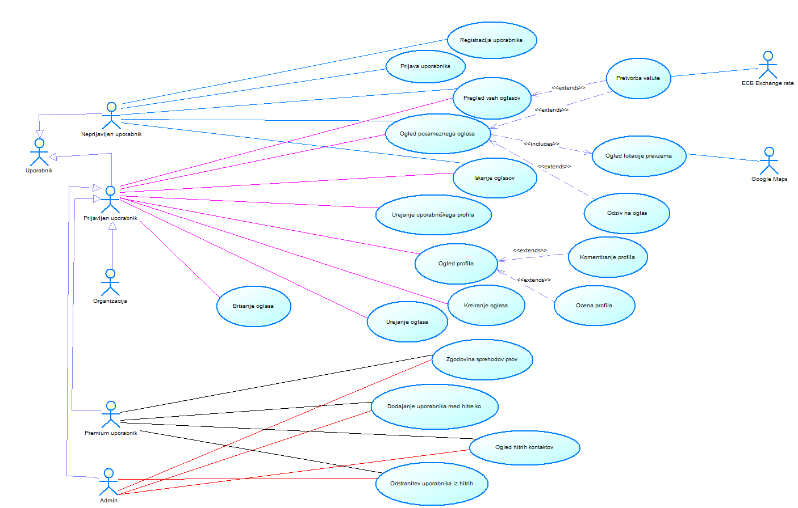

# Dokument zahtev

|                             |                                                         |
| :-------------------------- | :------------------------------------------------------ |
| **Naziv projekta**          | Dog Walkers                           |
| **Člani projektne skupine** | Gašper Božič, Gašper Kolbezen, Grega Kranjec, Matevž Vreš in Gašper Štepec |
| **Kraj in datum**           | Ljubljana, April 2021                                  |

## Povzetek projekta

**TO-DO**

- Povzetek je, kot že vemo, celoten dokument, strnjen v največ 150 besed.

## 1. Uvod

Aplikacija Dog Walkers rešuje problematiko pomanjkanja časa skrbi za domače živali, predvsem časa za sprehode. Mnogi zaradi službenih ali drugačnih obveznosti, kot je npr. dopust, ne morejo posvetiti časa domači živali vendar si želijo nekoga, ki bi za nekaj časa poskrbel za njihovega ljubljenčka. Obstaja pa tudi veliko ljudi, ki bi si želelo ukvarjati z živalimi zaradi denarja ali pa ker vedo da živali ne morejo nuditi dovolj časa, vendar ga imajo dovolj nekaj ur tedensko. Ponujamo rešitev, ki ti dve skupini ljudi poveže na našem portalu Dog Walkers.  
   
Aplikacija ponuja 3 različne profile: navaden uporabnik, organizacija ter premium uporabnik. Vsem je omogočeno brskanje po oglasih malih ljubljenčkov, ki potrebujejo varstvo. Oglasi vključujejo lokacijo prevzema ter valuto pretvorjeno po meri uporabnika. Profile uporabnikov je mogoče komentirati in ocenjevati glede na izkušnjo z uporabnikom ali njihovim štirinogim prijateljem. Skrbniki psov se lahko odzivajo na oglase lastnikov psov, medtem ko lahko lastniki te oglase kreirajo, urejajo ter brišejo. Premium uporabnik pa poleg vseh teh funkcionalnosti pridobi še pregled nad zgodovino sprehodov psov ter možnost dodajanja profilov med hitre kontakte.

## 2. Uporabniške vloge

**Neprijavljen uporabnik**  
Neprijavljen uporabnik si lahko ogleda seznam vseh oglase ter posamezne oglase. Oglase lahko tudi išče preko vgrajenega iskalnika. Vsak oglas ima vsebuje tudi funkcionalnosti lokacije prevzema psa ter pretvorbe valut, tako da ju vidi tudi neprijavljen uporabnik. Vsak neprijavljen uporabnik se ima možnost tudi registrirati ali prijaviti v sistem.  
  
**Organizacija**  
Organizacija je uporabniška vloga namenjena podjetje, ki želijo ponuditi svoje produkte lastnikom psov, zavetiščom ki potrebujejo prostovoljce itd. Organizacija ima najbolj osnovne funkcionalnosti saj imajo njene funkcionalnosti vključene tudi vse preostale vloge. Vsi **prijavljeni uporabniki** imajo naslednje funkcionalnosti: ogled seznama vseh oglasov ter posamezne oglase (s pripadujočima lokacija prevzema psa ter pretvorba valut), urejanje uporabniškega profila, iskanje oglasov, podajanje ocene ter podajanje komentarja profilu in še možnost ustvarjanja, urejanja ter brisanje posameznega oglasa ki ga je objavil sam. Organizacija nima nobenih unikatnih funcionalnostih.  

**Navaden uporabnik**  
Navaden uporabnik je uporabniška vloga namenjena tako skrbnikom psov kot tudi lastnikom psov saj se ti vlogi pogosto mešajo. Ima vse funkcionalnosti **Organizacije** oz. **prijavljenega uporabnika**, hkrati pa ima dodatno še možnost se odzivati na oglase ostalih uporabnikov.  
   
**Premium uporabnik**  
Premium uporabnik združuje vse funkcionalnosti Skrbnika psov ter Lastnika psa ter dodaja še možnost ogleda zgodovine sprehodov psov ter dodajanja profilov pod hitre kontakte. Premium uporabniku se tudi ne prikazujejo oglasi. 
  
**Admin**  
Admin ima vse funkcionalnosti Skrbnika psov ter dodajanje in možnost urejanja in brisanja katerega koli oglasa na portalu DogWalkers kot tudi brisanje vseh komentarjev na profilih uporabnikov.  

## 3. Slovar pojmov

**TO-DO**

- Natančno opredelite vse têrmine, ki jih boste uporabljali v nadaljevanju dokumenta.

## 4. Diagram primerov uporabe

  

## 5. Funkcionalne zahteve

V tem razdelku podrobno opišite posamezne funkcionalnosti, ki jih vaša aplikacija ponuja svojim uporabnikom. Za vsako funkcionalnost navedite naslednje podatke:

### TO-DO Naziv zahteve
|MUST|SHOULD HAVE|COULD HAVE|WOULD HAVE|
| :-- | :-- | :-- | :-- |
| registracija uporabnika| odziv na oglas  |  iskanje oglasov - search  | podaj komentar profilu  |
| prijava uporabnika  | pretvorba valute  |  podaj oceno profilu  |   ogled zgodovine sprehodov  |
| urejanje uporabniškega profila  | | | |
| ogled posameznega oglasa | | | | | 
| ogled lokacije prevzema | | | | | 
| ogled profila | | | | 
| kreacija oglasa  | | | | 
| vzdrževanje oglasa | | | | 
| brisanje oglasa | | | | 
| pregled vseh oglasov | | | | 
| dodaj profil pod "hitre kontakte" | | | | 
| brisanje komentarjev | | | | 

  
  
### **5.1 REGISTRACIJA UPORABNIKA**

### **Povzetek funkcionalnosti**

**Neprijavlen (neregistriran) uporabnik** lahko ustvari nov uporabniški račun. 

### **Osnovni Tok**

1. Neprijavleni uporabnik  izbere funkcionalnost ustvari račun
2. Sistem odpre okno z vpisnimi polji za uporabniško ime, e-poštni naslov in geslo
3. Neprijavleni uporabnik vpiše uporabniško ime, e-poštni naslov in nastavi geslo
4. Študent pritisne gumb za registracijo
4. Sistem preveri, če so vsi vnosi veljavni in če morda uporabnik s tem uporabniškim imenom ali e-poštnim naslovom obstaja
5. Sistem potrdi registracijo in na e-poštni naslov novega uporabnika pošlje potrditveno sporočilo

### **Izjemni Tok** 

1. Neprijavleni uporabnik v orodni vrstici izbere funkcionalnost ustvari račun
2. Sistem odpre okno z vpisnimi polji za uporabniško ime, e-poštni naslov in geslo
3. Neprijavleni uporabnik vpiše uporabniško ime, e-poštni naslov in nastavi geslo
4. Študent pritisne gumb za registracijo
4. Sistem preveri, če so vsi vnosi veljavni in če morda uporabnik s tem uporabniškim imenom ali e-poštnim naslovom obstaja
5. Sistem javi, da uporabnik s tem uporabniškim imenom ali e-poštnim naslovom že obstaja oz. da se geslo ne ujema z podanimi omejitavmi

### Alternativni tok(ovi)

Za prijavo ni alternativnih tokov.

### **Pogoji**

Uporabnik ne sme biti prijavlen 

### **Posledice**

Ustvarjen je nov uporabniški račun

### **Posebnosti**

Geslo novega uporabnika mora biti zgoščeno s standaradom SHA-2

### **Prioriteta**
MUST have

### **Sprejemni testi**

- Poskusi se registrirati z uporabniškim imenom, ki že obstaja

- Poskusi se registrirati s e-poštnim naslovom, ki je že v uporabi

- Poskusi se registrirati z napačnimi znaki v e-poštnem naslovu (brez @ ali domene)

- Poskusi se registrirati z gesli, ki se ne ujemata
  
  
### **5.2 PRIJAVA UPORABNIKA**

### **Povzetek funkcionalnosti**

**Admin, Navaden uporabnik, Premium Uporabnik in Organizacija** se lahko prijavijo v sistem. 

### **Osnovni Tok**

1. Neprijavljeni uporabnik izbere funkcionalnost prijava
2. Sistem odpre okno z vpisnimi polji za uporabniško ime / e-poštni naslov in geslo
3. Neprijavleni uporabnik vnese podatke za prijavo
4. Sistem preveri, če vneseni uporabniški račun obstaja in če je geslo pravilno
5. Sistem javi, da je prijava uspela, prijavleni uporabnik je preosmerjen na domačo stran.

### **Izjemni Tok** 
1. Neprijavljeni uporabnik izbere funkcionalnost prijava
2. Sistem odpre okno z vpisnimi polji za uporabniško ime / e-poštni naslov in geslo
3. Neprijavleni uporabnik vnese podatke za prijavo
4. Sistem preveri, če vneseni uporabniški račun obstaja in če je geslo pravilno
5. Sistem neprijavlenem uporabniku sporoči da ta uporabnik ne obstaja in/ali da je geslo napačno; prijava ni uspela 

#### **Alternativni tok(ovi)**

Ni alternativnih tokov.

#### **Pogoji**

Uporabnik ne sme biti prijavlen 

#### **Posledice**

Ustvarjen je nov uporabniški račun

#### **Posebnosti**

Geslo novega uporabnika mora biti zgoščeno s standaradom SHA-2

### **Prioriteta:**
MUST have

#### **Sprejemni testi**

- Poskusi se prijaviti z napačnim uporabniškim imenom.

- Poskusi se prijaviti z napačnim geslom.

- Poskusi se prijaviti večkrat zaporedoma z napačnimi vnosi, dokler sistem ne blokira prijave. 

### **5.3 UREJANJE UPORABNIŠKEGA PROFILA**

### **Povzetek funkcionalnosti**

**Admin, Navaden uporabnik, Premium Uporabnik in Organizacija** lahko urejajo nastavitve lastnega profila, ko so prijavljeni v aplikacijo. 

### **Osnovni Tok**

1. Prijavljen uporabnik izbere funkcionalnost ogled lastnega profila.
2. Sistem odpre zavihek s pregledom profila z uporabnikovimi podatki: ime, geslo, opis, e-poštni naslov, telefonska številka, kot tudi komentarje tega profila s strani drugih uporabnikov in oceno.
3. Prijavljen uporabnik preko izbire 'Urejaj' zahteva urejanje svojega profila.
4. Sistem s profilnega zavihka uporabnika preusmeri na obrazec s polji, v katerih je mogoče spreminjati uporabniške podatke (ime, geslo, opis, e-poštni naslov, telefonska številka).
5. Prijavljeni uporabnik spremeni željena vnosna polja.
6. Prijavljeni uporabnik izbere funkcionalnost shrani.
7. Sistem preveri ali so spremenjeni podatki zapisani z dovoljenimi znaki in omejene dolžine ter shrani spremembe in uporabnika iz obrazca vrne na ogled profila.

### **Alternativni Tok** 
**TO-DO**

### **Izjemni Tokovi** 
**1.**  
  **1.1.** Prijavljen uporabnik izbere funkcionalnost ogled profila   
  **1.2.** Izbere urejanje uporabniškega profila  
  **1.3.** Prijavljen uporabnik spremeni vnosna polja in uporabi nedovoljene znake.  
  **1.4.** Sistem ne dovoli shranjevanja in opozori na uporabljene nedovoljene znake.  

**2.**  
  **2.1.** Prijavljen uporabnik izbere funkcionalnost ogled profila  
  **2.2.** Izbere urejanje uporabniškega profila  
  **2.3.** Prijavljen uporabnik spremeni vnosna polja in uporabi preveliko število znakov za vnosno polje.   
  **2.4.** Sistem ne dovoli shranjevanja in opozori na predolgo dolžino znakov v teh vnosnih poljih.  

**3.**  
  **3.1.** Prijavljen uporabnik izbere funkcionalnost ogled profila  
  **3.2.** Izbere urejanje uporabniškega profila  
  **3.3.** Prijavljen uporabnik spremeni vnosna polja in uporabi nepravilne znake v poljih, ki zahtevajo poseben format (e-poštni naslov, telefonska številka).  
  **3.4.** Sistem ne dovoli shranjevanja in opozori na napačen format znakov v teh vnosnih poljih.  

**4.**  
  **4.1.** Prijavljen uporabnik izbere funkcionalnost ogled profila   
  **4.2.** Izbere urejanje uporabnikega profila  
  **4.3.** Prijavljen uporabnik spremeni vnosna polja vendar ne potrdi shranjevanja sprememb.   
  **4.4.** Spremembev urejanju se ne shranijo.  

### **Pogoji**
Uporabnik mora biti registriran v sistemu in prijavljen.

### **Posledice**
Uporabnikovi osebni podatki so spremenjeni. Spremembe so vidne tudi ostalim uporabnikom
sistema, ko si ogledajo njegov profil.

### **Posebnosti**
**TO-DO**
Sistem mora podpirati možnost (gumb) nalaganja profilne slike omejene velikosti iz uporabnikovega računalnika v sistem na profil??? => če damo to potem je treba popravit/dopolnit tokove

### **Prioriteta**
MUST have

### **Sprejemni testi**
**TO-DO** (mrbit za dopolnit?)  

**1.** Uporabnik mora biti registriran in prijavljen pred začetkom testa.
**2.** Testiramo sprejem nedovoljenih znakov v polju za ime.
  - Izberi svoj profil 
  - Izberi urejanje
  - Spremeni vnosno polje za ime v "@!./"
  - Shrani spremembe  

**3.** Pričakovan rezultat je opozorilo (v obliki pojavnega okna), ki opozarja na uporabo nedovoljenih znakov. Spremembe se **NE** shranijo.
  
  
### **5.4 PODAJ OCENO PROFILU**

### **Povzetek funkcionalnosti**

TO-DO : nekje bo treba upoštevat in napisat še kaj glede profilov, ki še nimajo ocene.

**Admin, Navaden uporabnik, Premium Uporabnik in Organizacija** lahko podajo kvantitativno oceno profilu s katerim so vsaj enkrat stopili v kontakt oziroma opravili medsebojno storitev, katere namen nudi aplikacija. 

### **Osnovni Tok**
**TO-DO ZA POPRAVIT MALO KO BO VEČ ZAHTEV DEFINIRANIH!!**
1. Prijavljen uporabnik izbere funkcionalnost ogled profila drugega uporabnika.
2. Sistem odpre zavihek s pregledom profila izbranega uporabnika in prikaže njegove podatke.
3. Sistem omogoči urejanje ocene v kolikor sta uporabnika že opravila vsaj eno namensko storitev aplikacije oziroma imata zgodovino.
4. Prijavljen uporabnik preko funkcionalnosti za ocenjevanje izbere urejanje ocene.
5. Sistem uporabniku omgoči izbiro ocene z lestvice.
6. Uporabnik izbere oceno in potrdi izbor.
7. Sistem posodobi skupno oceno ravnokar ocenjenega profila glede na podano oceno.

### **Alternativni Tok** 
**TO-DO**

### **Izjemni Tokovi** 
**1.**  
  **1.1.**  Prijavljen uporabnik izbere funkcionalnost ogled profila drugega uporabnika.
  **1.2.**  Izbere urejanje ocene.
  **1.3.**  Prijavljen uporabnik spremeni oceno z lestvice in ne shrani izbire.
  **1.4.**  Sistem ne spremeni ocene in ohrani staro vrednost.

**2.**  
  **2.1.**  Prijavljen uporabnik izbere funkcionalnost ogled profila drugega uporabnika.  
  **2.2.**  Prijavljen uporabnik s tem uporabnikom še ni opravil nobene storitve, zato mu je urejanje ocene onemogočeno.  
  **2.3.**  Sistem zakrije izbiro urejanja ocene in izpiše obvestilo.

### **Pogoji**
Uporabnik mora biti registriran v sistemu in prijavljen. Uporabnik, ki želi podati oceno drugemu uporabniku, mora imeti s tem uporabnikom že zgodovino sodelovanja oziroma opravljenih storitev preko aplikacije, sicer medsebojno ocenjevanje med uporabnikoma ni omogočeno na njunih profilih.

### **Posledice**
Ocena profila, kateremu je uporabnik spreminjal svojo oceno se spremeni. Spremembe so vidne tudi ostalim uporabnikom v sklopu skupne ocene uporabnika, ko si ogledajo njegov profil.

### **Posebnosti**
**TO-DO**

### **Prioriteta:**
COULD have

### **Sprejemni testi**

**1.** Uporabnik mora biti registriran in prijavljen v sistem. Izbran profil za ocenjevanje mora biti lastnik psa, uporabnik, ki testira pa skrbnik psa. Uporabnik mora imeti opravljeno storitev s tem lastnikom psa.  
**2.** Testiramo ali se ocena profila shrani.
  - Uporabnik gre na profil lastnika psa, ki izpolnjuje pogoje napisane v točki 1.  
  - Izbere urejanje ocene  
  - Poda oceno z lestvice  
  - Shrani spremembe  

**3.** Pričakovan rezultat je shranjena ocena.  

  
  
### **5.5 PREGLED VSEH OGLASOV**

### **Povzetek funkcionalnosti**

Vsi uporabniki si lahko ogledajo seznam vseh oglasov s sliko psa ter osnovnimi podatki. Pregled vseh oglasov je prva stran naše spletne aplikacije.

### **Osnovni Tok**

1. Ob naložitvi aplikacije se prikaže seznam vseh oglasov, ki so naloženi po 50 v straneh.

### **Izjemni Tok** 

Funckionalnost nima izjemnih tokov.

#### **Alternativni tok(ovi)**

Funkcionalnost nima alternativnih tokov

#### **Pogoji**

Funkcionalnost nima nobenih pogojev za izvedbo.

#### **Posledice**

Prikaže se seznam vseh aplikacij z nekaj osnovnimi podatki vsakega oglasa ter sliko psa ter ceno če je oglas skrbnika psov ali organizacije.

### Posebnosti

Funkcionalnost vključuje funkcionalnost **Pretvorba valut** za prikaz cen v uporabnikovi valuti.

### **Prioriteta**
MUST have

#### **Sprejemni testi**

**1.** Uporabnik mora imeti stabilno internetno povezavo. Prijava ni potrebna.  
**2.** Testiramo ali se prikaže pregled vseh oglasov
  - Uporabnik gre na spletni naslov aplikacije Dog Walkers.  

**3.** Pričakovan rezultat je prikazan pregled vseh oglasov.  

### **5.6  OGLED POSAMEZNEGA OGLASA**

### **Povzetek funkcionalnosti**

Vsi uporabniki si lahko ogledajo posamezni oglas. 

### **Osnovni Tok**

1. Uporabnik odpre aplikacijo, prikažejo se mu vsi oglasi.
2. Uporabnik pritisne na oglas
3. Na zaslonu se izpišejo vse informacije o oglasu

### **Alternativni tok 1**

1. Uporabnik odpre aplikacijo, prikažeju se mu vsi oglasi
2. Uporabnik odpre profil enega od lastnikov psa
3. Na zaslonu se izpišejo informacije o profilu in oglasi tega lastnika
3. Uporabnik med oglasi lastnika izbere oglas
4. Na zaslonu se izpišejo vse informacije o oglasu 

### **Pogoji** 

Ni posebnih pogojev

### **Posledice**

Odpre se oglas

### **Posebnosti**

Ni posebnosti

### **Prioriteta**
MUST have

### **Sprejemni testi**

- Pritisni na oglas, preveri če se odpre. 

- Odpri profil nekega uporabnika in poskusi odpreti oglas na profilni strani

### **5.7 OGLED LOKACIJE PREVZEMA**

### **Povzetek funkcionalnosti**

Vsi uporabniki si lahko ogledajo lokacijo prevzema posameznega oglasa.

### **Osnovni Tok**

1. Uporabnik odpre oglas
2. Na oglasu pritisne na gumb "prikaži lokacijo prevzema"
3. Izpiše se google zemljevid na katerem je označena lokacija prevzema

### **Pogoji** 

Ni posebnih pogojev

### **Posledice**

Odpre se zemljevid

### **Posebnosti**

Ni posebnosti

### **Prioriteta**
MUST have

### **Sprejemni testi**

- Preiskusi odpreti zemljevid na posameznem oglasu

### **5.8 PODAJ KOMENTAR PROFILU**

### **Povzetek funkcionalnosti**

TO-DO : nekje bo treba upoštevat in napisat še kaj glede profilov, ki še nimajo komentarja.

**Admin, Navaden uporabnik, Premium Uporabnik in Organizacija** lahko podajo komentar profilu s katerim so vsaj enkrat stopili v kontakt oziroma opravili medsebojno storitev, katere namen nudi aplikacija. 

### **Osnovni Tok**
**TO-DO ZA POPRAVIT MALO KO BO VEČ ZAHTEV DEFINIRANIH!!**
1. Prijavljen uporabnik izbere funkcionalnost ogled profila drugega uporabnika.
2. Sistem odpre zavihek s pregledom profila izbranega uporabnika in prikaže njegove podatke.
3. Sistem omogoči urejanje komentarja profila v kolikor sta uporabnika že opravila vsaj eno namensko storitev aplikacije oziroma imata zgodovino.
4. Prijavljen uporabnik preko funkcionalnosti za komentiranje izbere urejanje koemntarja.
5. Sistem uporabniku omgoči vnosno polje za komentar.
6. Uporabnik napiše komentar in izbere shrani.
7. Sistem posodobi komentar na tem profilu.

### **Alternativni Tok** 
**TO-DO**

### **Izjemni Tokovi** 
- Prijavljen uporabnik izbere funkcionalnost ogled profila drugega uporabnika in izbere urejanje komentarja.
Prijavljen uporabnik napiše komentar v vnosno polje in ne shrani urejanja.
Sistem ne spremeni komentarja in ohrani staro vrednost.

- Prijavljen uporabnik izbere funkcionalnost ogled profila drugega uporabnika in izbere urejanje komentarja.
Prijavljen uporabnik napiše komentar v vnosno polje in uporabi nedovoljene znake.
Sistem ne dovoli shranjevanja komentarja in izpiše obvestilo.

- Prijavljen uporabnik izbere funkcionalnost ogled profila drugega uporabnika.
Prijavljen uporabnik s tem uporabnikom še ni opravil nobene storitve, zato mu je urejanje
komentarja onemogočeno. Sistem zakrije izbiro urejanja in podajanja komentarja in izpiše obvestilo.

### **Pogoji**
Uporabnik mora biti registriran v sistemu in prijavljen. Uporabnik, ki želi podati komentar drugemu uporabniku, mora imeti s tem uporabnikom že zgodovino sodelovanja oziroma opravljenih storitev preko aplikacije, sicer medsebojno podajanje komentarjev med uporabnikoma ni omogočeno na njunih profilih.

### **Posledice**
Na profilu, ki je bil komentiran se pojavi nov komentar osebe, ki ga je napisala oziroma se posodbi njen že obstoječi komentar. Spremembe so vidne tudi ostalim uporabnikom, ko si ogledajo komentirani profil.

### **Posebnosti**
**TO-DO**

### **Prioriteta:**
WOULD have

### **Sprejemni testi**
**1.** Uporabnik mora biti registriran in prijavljen v sistem. Izbran profil mora biti (za pravilno shranjevanje komentarja)  lastnik psa, uporabnik, ki testira pa skrbnik psa. Uporabnik mora imeti opravljeno storitev s tem lastnikom psa. Za potrebe testa mora biti ta pogoj **NEIZPOLNJEN**  
**2.** Testiramo ali funkcija za komentar profila zazna neizpolnjen pogoj in ga ne shrani.  
  - Uporabnik gre na profil lastnika psa, ki **NE** izpolnjuje 2. pogoj napisan v točki 1.  
  - Izbere dodajanje komentarja
**3.** Pričakovan rezultat je opozorilo (v obliki pojavnega okna), ki opozarja na neizpolnjen pogoj. Polje za dodajanje komentarja se ne pojavi.  

## 6. Nefunkcionalne zahteve

**TO-DO**

- Navedite splošne omejitve, ki jih moramo upoštevati v več funkcionalnostih ali celo skozi celoten razvoj aplikacije.

### 6.1 Zahteve izdelka
- sistem mora biti na voljo 99% časa
- sistem mora biti dosegljiv na javno dostopnem spletnem naslovu
- sistem uporabniku ne sme omogočati dostopa uporabniku do podatkov, do katerih ni pooblaščen.
- latenca zahtev ne sme presegati 500ms
- spletna stran deluje na večini mobilnih naprav
- sistem mora za komunikacijo uporabljati SSL certifikat (enkripcija)
### 6.2 Organizacijske zahteve
- sistem mora imeti implementiran "ali si robot" preverjanje
- sistem mora omogočati vsaj enega administratorja
- sistem mora omogočati hranjenje varnostnih kopij 
### 6.3 Zunanje zahteve
- sistem ne sme vsebovati vulgarnih besed
- sistem mora imeti obvezna obvestila o hranjenju podaktov in piškotkov
- sistem mora imeti izpostavljene ustrezne legalne dokumente

## 7. Prototipi vmesnikov

### 7.1 Osnutki zaslonskih mask
**TO DO**  

### 7.2 Vmesniki do zunanjih sistemov  
**Pretvornik valut ECB Exchange rate**  
Ob nalaganju strani, ki prikazuje seznam vseh oglasov, ob nalaganju posameznega oglasa ter ob kreiranju novega oglasa se bo klicala funkcija **converter(currency1, currency2, value)**, ki sprejme dva stringa kratic valut ter tabelo vrednosti imenovano *value*, ki vsebuje valute *currency1* katere želi pretvoriti v valuto *currency2*.  
Funkcija bo vrnila tabelo vrednosti pretvorjenih v valuto *currency2*  
  
*currency1* in *currency2* primer: 'EUR', 'USD',...  
*value* primer: 100, 200, 233.523,...  

**Google Maps API**  
Ob nalaganju strani, ki prikazuje posamezni oglas se bo klicala funkcija **initMap(lokacija)**, ki sprejme string naslova možnega prevzema psa.  
Funkcija prikaže zemljevid z označeno lokacijo možnega prevzema na zemljevidu.  
  
*lokacija* primer: "Ritoznoj 33, Slovenska Bistrica"  

